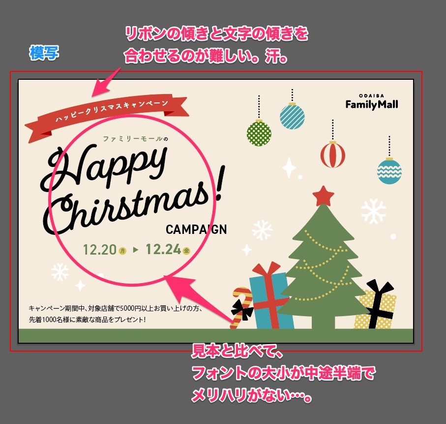
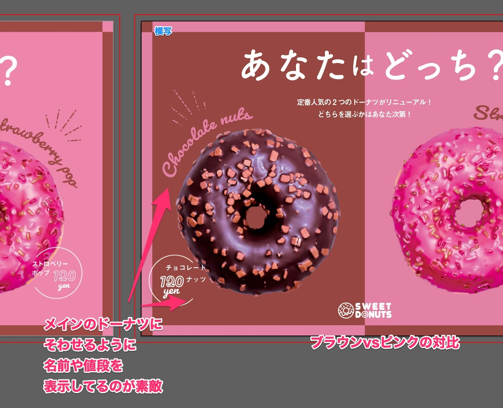
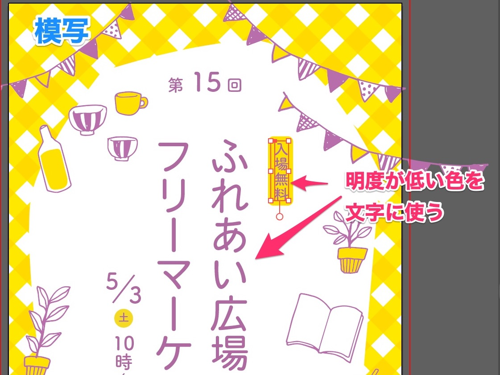
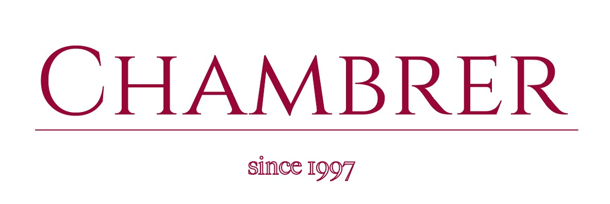
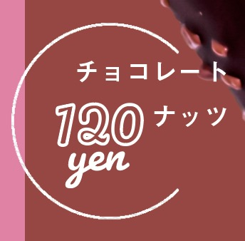

トレースは、バナーや広告などの見本を、自分で再現しながらデザインを学ぶ練習手法です。

実際に真似ることで、デザインの引き出しを増やしたり、ツールの使い方になれることができます。

## デザイン力をあげるトレース＆模写

私は前に一度、トレースをやってみたことがあるのですが、
見本となる画像を探したり、画像と同じフォントや素材を探すのに時間がかかってしまい、
全然進まなくて挫折してしまいました。

そこで、いい本を見つけました。

<a href="//af.moshimo.com/af/c/click?a_id=742757&p_id=56&pc_id=56&pl_id=637&s_v=b5Rz2P0601xu&url=http%3A%2F%2Fbooks.rakuten.co.jp%2Frb%2F16312596%2F" target="_blank" rel="nofollow" >トレース＆模写で学ぶ　デザインのドリル</a>
posted with <a href="https://yomereba.com" rel="nofollow" target="_blank">ヨメレバ</a>

Power Design Inc. ソシム 2020年06月22日頃    

<a href="//af.moshimo.com/af/c/click?a_id=742757&p_id=56&pc_id=56&pl_id=637&s_v=b5Rz2P0601xu&url=http%3A%2F%2Fbooks.rakuten.co.jp%2Frb%2F16312596%2F" target="_blank" rel="nofollow" >楽天ブックス</a>

<a href="https://www.amazon.co.jp/exec/obidos/asin/4802612575/filledfores07-22/" target="_blank" rel="nofollow" >Amazon</a>

<a href="https://www.amazon.co.jp/gp/search?keywords=%E3%83%88%E3%83%AC%E3%83%BC%E3%82%B9%EF%BC%86%E6%A8%A1%E5%86%99%E3%81%A7%E5%AD%A6%E3%81%B6%E3%80%80%E3%83%87%E3%82%B6%E3%82%A4%E3%83%B3%E3%81%AE%E3%83%89%E3%83%AA%E3%83%AB&__mk_ja_JP=%83J%83%5E%83J%83i&url=node%3D2275256051&tag=filledfores07-22" target="_blank" rel="nofollow" >Kindle</a>

<a href="//af.moshimo.com/af/c/click?a_id=1082680&p_id=932&pc_id=1188&pl_id=12456&s_v=b5Rz2P0601xu&url=http%3A%2F%2F7net.omni7.jp%2Fsearch%2F%3FsearchKeywordFlg%3D1%26keyword%3D9784802612579" target="_blank" rel="nofollow" >7net</a>

<a href="//ck.jp.ap.valuecommerce.com/servlet/referral?sid=3390948&pid=885314885&vc_url=http%3A%2F%2Fhonto.jp%2Fnetstore%2Fsearch_021_104802612575.html%3Fsrchf%3D1%26srchGnrNm%3D1&vcptn=kaereba" target="_blank" rel="nofollow" >honto</a>
         
<a href="//ck.jp.ap.valuecommerce.com/servlet/referral?sid=3390948&pid=886623503&vc_url=http%3A%2F%2Fwww.kinokuniya.co.jp%2Ff%2Fdsg-01-9784802612579&vcptn=kaereba" target="_blank" rel="nofollow" >紀伊國屋書店</a>
              

  
    この本を選んだ理由
  

* デザインのポイントが言葉で説明されている
* 同じ素材で複数の作成例が紹介されており、デザインの引き出しが増やせる
* 元の写真や素材が提供されているので、素材探しに時間をとられず模写に集中できる

この「トレース＆模写で学ぶ　デザインのドリル」を順に進めていけば、いろんなデザインに触れられて、自分でも同じデザインを再現できる力が身につくわけです！

## デザイントレースの歩み

ここからは、実際のトレースの様子を記録しています。

1日1トレースを目標に、現時点で17個目まで進めました。

本にはデザインの解説ページがあるので、「なんとなく真似た」で終わらせずに、デザインの要点を理解できます。

### Lesson 1〜6 構成を学ぶ

まずは、パーツのレイアウト、揃え方を学びます。

* 字間を広めに開けると、文字を強調できる
* 読ませたい文字とその他の文字で差をつけるために、フォントサイズの大小、色の濃淡をはっきりつける。

* 意味のあるグループごとに隙間を開けている
* 住所や電話は、左寄せにして文頭を揃えて、読みやすく。

* Happy Chirstmasなど、メインの文字は思い切って大きく。
* 「ファミリーモール」に対して、「の」は小さく、文字の優先順位を明確にする
* 同様に、「日付」に対して「曜日」は小さい

* 文字の並びと写真の人物の位置がバランス良くなるように、写真を切り抜く
* 写真に文字を重ねて動きを出す
* 黄土色もゴールドっぽく見えて高級感が出る。

* 商品の色を主体に、対比させる。
* ドーナツの円を生かした丸みのある配置が素敵。
* 円を欠けたり、線を点線にするのに苦戦

* 写真と文字の横幅、中央は揃えて全体のバランスをとる（模写したやつは、ちょっとずれてる）
* 全て整列させるのではなく、右にずらして文章を重ねたり、フォントを手書きっぽくして、リラックスした感じがでている。
* 写真の上下／左右の余白が違うのも、アートっぽい感じがする。

### Leson 7〜11 配色

ここからは、配色をテーマにした演習です。
色に関してはどの色を使っているか書かれているので、迷わなかったです。
でも、自分で同じような配色を作れるかというとまた別問題・・・。

メモしてて気づきましたが、模写したやつは文字のベースラインが下に揃っていない…。

* 青で清潔感や誠実さを表現（背景のタイルっぽいのも洗面所のようで清潔感がある）
* 同じ青系でも、文字は明度や彩度を変えて目立たせている。
* 「肌」や「悩」など、文字を大きくして印象付けている。

これのやり方を忘れて、調べました。

Illustratorのダイレクトツールで角をクリックすると、角を丸くできます。

最初は角丸になっていて、上↑と下↓で、かどの形を切り替えられます。

コーナーの点をダブルクリックしてもオプションが出てきます。

また、ダイレクト選択ツール選択時に、上のツールバーに「コーナー（ライブコーナー）」の項目があるので、そこでも形や角の丸み（px）を調整できます。

* 同じ赤でも濃度を変えて、コントラストをつける
* フォントを明確に変えるとメリハリがつく

このふにゃっとした線、どうやってつくるんだろ。

円にそわせるのが難しい

* 黄色×紫でインパクトがある組み合わせ！
* 濃い方（紫）を文字に使う

今回のハイライトは、文字のベースラインの、数字の向きの揃え方を学びました。

これとか

これとか

どちらも、文字パネルの右上のメニューバー＞文字揃え＞欧文ベースラインで揃います。

次は、二色を使ってイメージを表現する演習です。

やってみると

* 釣り合う二色を選ぶのが難しい
* いつも似た色をばかり選んでしまう

いいなぁと思った色合いをストックしておくことが大事だなと思いました。

### Lesson 12〜17　文字

次はフォントで印象がどのように変わるのかを練習しました。

【各フォントの特徴】

* 細めの明朝体だと、女性らしく
* 丸ゴシックだと、親やすい印象

【フォントを使うときのポイント】

* だいたい２種類のフォントを使う（メインの題字とサブ情報で使い分け）
* 重めのフォントと軽めのフォントでメリハリをつける
* 見せるフォントと読ませるフォントの使い分け

続いてお題の文字をフォントで、ロゴにする演習です。

1つ目は高級レストランのロゴ。

* 大人のカップルがワインを楽しむイメージでワインレッドをチョイス。
* ワインのボトルのように、
* セリフ体で高級感を演出

2つ目は、学生向けキャンペーンのロゴ。

* 春なのでピンクを選択。
* 学生の活気が現れるように、サブカラーに黄色を選択、また丸ゴシックで親近感を出す。
* 優先順位の高い順に文字サイズを変えてみる。

色は春っぽさが出ているけれど、なんだか寂しい💦
特にキャンペーンと日付のところは飾ることができていないでそのまま文字だけになっています…。

本で紹介されていた作例には
* 斜めにして勢いを出す
* 桜の花びらをフォントに取り入れて、春らしさを伝える
などと、工夫が凝らされていました。

* 一番見せたい「学生応援」は、二色使う
* 日付のところを目立たせるため、強めのフォントにして飾る。
* 「春の」のまわりは線→三角にして、メガホンぽくする。

少しは良くなったかな？

「学生応援キャンペーン」で画像検索してみると、
桜を使っていたり、応援のイメージでメガホンを使っている。

作る前に、どういったデザインがあるのか、参考デザインをいっぱいみておくのも大事だと思いました。

### Lesson 18〜
演習が進んだら、追記予定です。

## やってみた感想

実際に手を動かしてやってみると、
細かいデザインのあしらいに気がつくようになりました。

例えば、１文字ごとにサイズが違ったり、微妙に文字間を調整していたり、

文字にカーブをかけたり、

円を欠けさせたり、

また、デザインをする時に、

どうして、「この色を選んだのか」「このフォントにするのか」「フォントの大きさはこれでいいのか？」

各パーツを選ぶ意味、置く意味を考えるようになりました。
