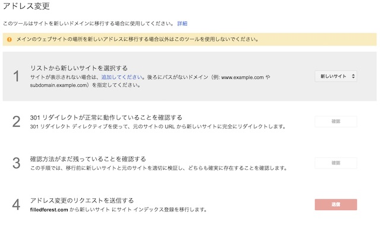
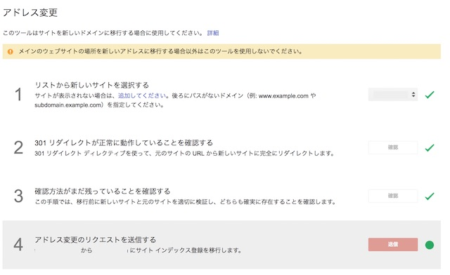
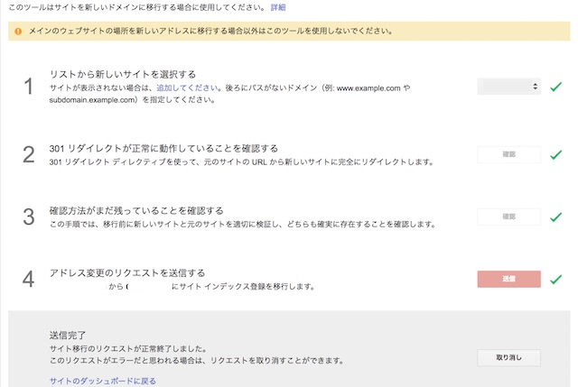
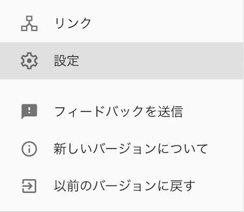
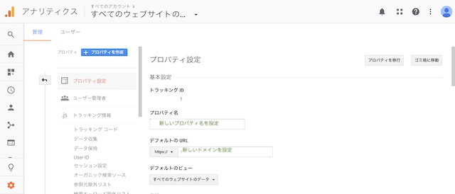
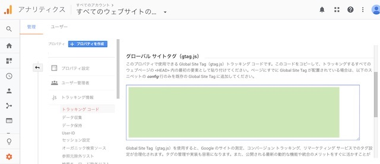
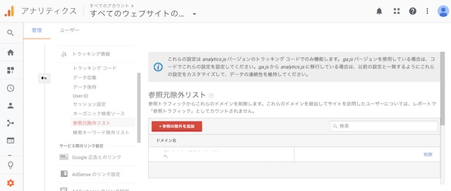
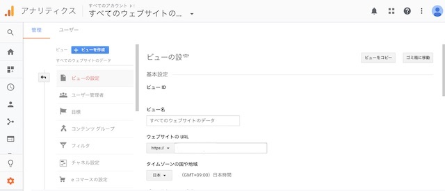

WordPressのドメインを変更しました。
WordPress内の記事や画像データをそのまま新しいURLに移すやり方をお伝えします。

## ドメインを変更するデメリット

* 引っ越し作業が大変。。。
* Googleさんからはドメインの使用年数を評価されます。新しいドメインは歴史がないので、検索順位が下がる可能性があります。
* 訪問者さんへのお知らせが必要

### ドメインの変更手順

この手順で進めていきます。

1. 新しいドメイン（URL）を取る
2. 新しいドメイン（URL）でWordPressをインストールする
3. 旧サイトから新サイトへデータを引っ越す
4. 旧サイトから新サイトへ転送設定
5. 301リダイレクト設定

### 手順① 新しいドメイン(URL)を取得する

ドメイン会社から新しいドメインを取得します。
新しく追加したドメインには忘れず、ネームサーバーを設定しましょう。

例は私が使っているMixhostの設定です。
お使いのサーバーによって設定値が変わりますのでご確認くださいませ。

### 手順② 新しいドメイン（URL）でWordPressをインストールする

サーバーは今使っているサーバーと同じでも、別のサーバーと契約しても構いません。

サーバーに新しいドメインを追加します。
追加したドメインにWordPressソフトをインストールします。
※旧ドメインはまだ使いますので、削除しないでください。

### 手順③ 旧サイトから新サイトへデータを引っ越す

旧サイトのデータをダウンロードして、新サイトにデータをコピーします。

プラグイン[All-in-One WP Migration](https://ja.wordpress.org/plugins/all-in-one-wp-migration/)を使うと簡単です。

1. 新サイトと旧サイト両方にAll-in-One WP Migrationをインストールし、有効化します。
2. All-in-One WP Migrationを使って、旧サイトからデータをエクスポートします。
3. エクスポートしたデータを、All-in-One WP Migrationを使って、新サイトにインポートします。

### 手順④ 旧サイトのデータを消す

Web上に同じサイトが２つあると、不正なコピーサイトとして認識されてしまうので、新しいサイトが公開できたら、旧サイトは思い切って削除してしまいましょう！※旧ドメイン自体は、削除しないでくださいね。

サーバーの管理画面からWordPressのアンインストールができると思います。

リンク切れが発生していないかを確認します。

プラグイン「[Broken Link Checker](https://ja.wordpress.org/plugins/broken-link-checker/)」を入れてください。

旧サイトのデータを削除したので、新サイトURLにうまく変更できていないと場合には、リンク切れとなってしまいます。
リンク切れを見つけたら、新しいサイトのURLに更新していきましょう。

量が多い場合には、プラグイン「[Search Regex](https://ja.wordpress.org/plugins/search-regex/)」を使ってみてください。文字列を検索&一括置換できます。

### 手順⑤ 旧サイトから新サイトへ転送設定（301リダイレクト設定）

このままだと、ユーザーが旧ドメイン(URL)を訪れた時に、データがないため、リンク切れになってしまいます。
転送設定を行うことで、自動で新サイトに移動できるようになります。
この作業はリダイレクト（転送）と呼ばれています。

リダイレクト設定を行うことで、旧サイトの評価を新しいサイトへ引き継ぐことができます。

「.htacess」という、サーバー設定ファイルを書き換えます。
サーバーの管理画面かFTPツールを使って、旧サイトのフォルダにアクセスします。
旧サイトのデータが置かれているフォルダ直下に「.htaccess」ファイルがあると思うので、下記のように記述します。（ファイルがない場合には新しく作ってください。）

【豆知識】
今回のように、古いURLから新しいURLに切り替わる時にはリダイレクトと呼ばれる転送設定を行います。
リダイレクトの数字によって、転送の種類が区別されています。
301 永久的にURLの変更
302 一時的なURLの変更

今回は、古いURLはもう使わないので、301リダイレクト設定になります。

## 切り替え後にやること
### Google Search Consoleの設定変更

GoogleにもサイトのURLが変わったことをお知らせするために、Google Search Consoleからアドレス変更を通知します。

管理画面を開きます。
まず、新ドメインのプロパティ管理を追加します。

旧ドメインのプロパティ管理を開いて、右上の歯車からアドレス変更をクリックします。

アドレス変更の画面が開きます。
１.リストから新しいサイトのドメインを選択します。

あとは、手順通りに確認ボタンをクリックしていきます。

アドレス変更リクエストの送信ボタンを押して、完了です。

### Google Analyticsの設定変更

Google Analyticsでアクセス解析を行っている場合には、新サイトへの設定変更が必要になります。

Google Analyticsを開いて、旧サイトの設定画面にいきます。

ユーザー管理者＞プロパティ設定を開きます。

【プロパティ設定】
プロパティ名：新しいプロパティを設定
デフォルトのURL：新しいドメインを設定

【トラッキングコード】

もし、アナリティクスのトラッキングコードを外してしまっていたら、新しいサイトにも設置してあげてください。

参照元除外リストのドメインを旧ドメイン→新ドメインに変更します。

【ビューの設定】
ウェブサイトのURL：新しいドメインを設定

 これで、旧サイトから新サイトへアクセスデータを引き継げるようになります。

## まとめ

ドメイン変更の時に行った作業を記録しました。

旧サイトのドメインを削除してしまうと、リダイレクト設定がなくなり、旧サイトにアクセスした時にリンク切れになってしまいます。
旧サイトへのアクセスが落ち着いた後に削除すると良いでしょう。
