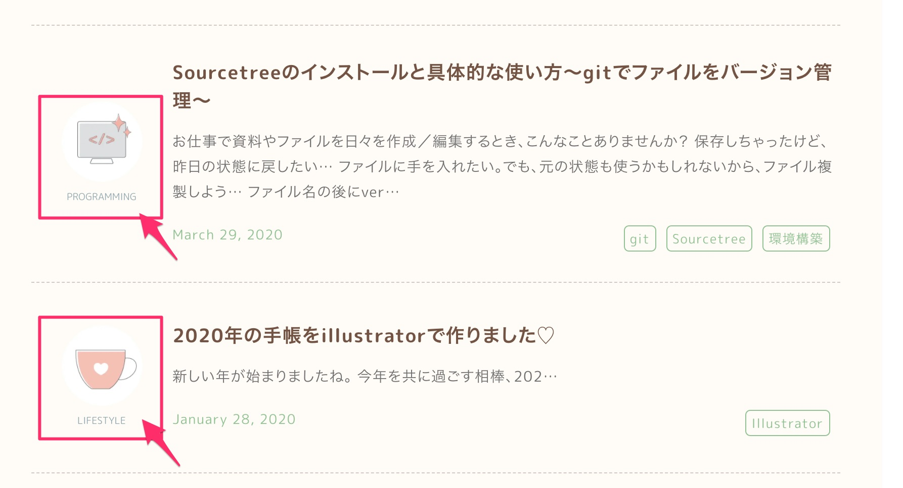
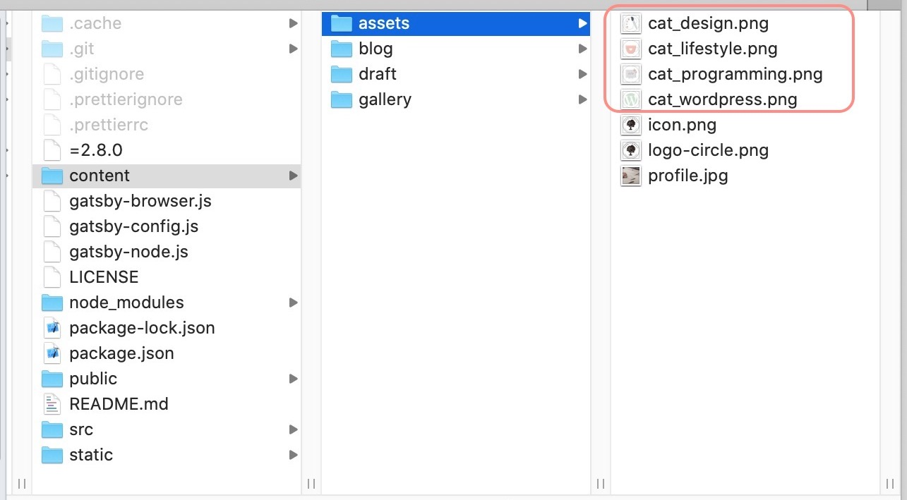
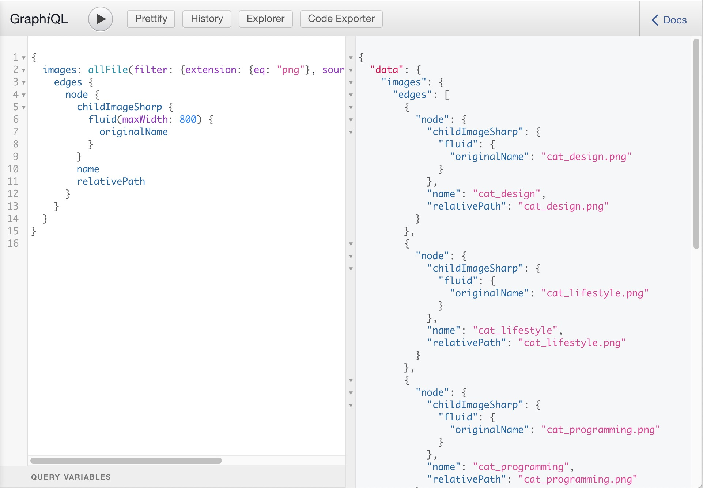

ブログ記事にカテゴリーのアイコンを表示させました。



【やりたかったこと】
* 各記事にはカテゴリーが一つ設定されている
* 記事一覧にカテゴリー画像を表示する
* gatsby-imageで画像を表示させたい

【参考記事】
* [パスを渡せばgatsby-imageで画像を表示してくれるコンポーネントの作成方法](https://takumon.com/simple-gatsby-image-wrapper/)
* [Easy Gatsby Image Components](https://noahgilmore.com/blog/easy-gatsby-image-components/)

## Gatsby-configの設定

カテゴリー画像をフォルダに入れます。



プラグインにgatsby-source-filesystemを利用し、画像の格納場所を設定します。

```js:title=gatsby-config.js
module.exports = {
  plugins: [
    {
      resolve: `gatsby-source-filesystem`,
      options: {
        path: `${__dirname}/content/assets`,
        name: `assets`,
      },
    },
    `gatsby-transformer-sharp`,
    `gatsby-plugin-sharp`,

        (以下省略)

    }
  ],
}
```

そして、サイトメタデータには、カテゴリーの一覧を設定します。
項目は名前（name）とスラッグ（slug）と画像URL（image）の３つです。
```js:title=gatsby-config.js
module.exports = {
  siteMetadata: {

        (titleやsiteUrlなどいろいろ)

    categories: [
      {
        name: `Programming`,
        slug: `programming`,
        image: `cat_programming.png`,
      },
      {
        name: `Design`,
        slug: `design`,
        image: `cat_design.png`,
      },
      {
        name: `WordPress`,
        slug: `wordpress`,
        image: `cat_wordpress.png`,
      },
      {
        name: `Column`,
        slug: `column`,
        image: `cat_column.png`,
      },
    ],
  },

        (以下省略)

}
```


## カテゴリー画像を表示するコンポーネント

まず、GraphQLでassetsに保存した画像を取得するクエリを書きます。

`http://localhost:8000/___graphql`


```
{
  images: allFile(
    filter: {extension: {eq: "png"},
    sourceInstanceName: {eq: "assets"}}
    ) {
    edges {
      node {
        childImageSharp {
          fluid(maxWidth: 800) {
            originalName
          }
        }
        name
        relativePath
      }
    }
  }
}
```

`sourceInstanceName: {eq: "assets"}`で、gatsby-configに指定した、ファイル格納場所のnameを設定すると画像フォルダに絞り込めます。




こんな感じで取得できました。


## カテゴリー画像表示用のコンポーネントを作る

二つのコンポーネントを用意します。

A: 画像名を受け取って、画像を表示するコンポーネント

B: カテゴリー名を受け取って、カテゴリー表示するコンポーネント


### A: 画像名を受け取って、画像を表示するコンポーネント

```js:title=src/components/categoryimage.js
import React from "react"
import { useStaticQuery, graphql } from "gatsby";
import Img from "gatsby-image"

export default props => {
  const catImages = useStaticQuery(graphql`
    query {
      allFile(
        filter: {
          extension: {eq: "png"},
          sourceInstanceName: {eq: "assets"}
        })
      {
        edges {
          node {
            name
            relativePath
            childImageSharp {
              fluid(maxWidth: 800) {
                ...GatsbyImageSharpFluid_withWebp
              }
            }
          }
        }
      }
    }
  `)
  const image = catImages.allFile.edges.find(n => {
    return n.node.relativePath.includes(props.filename)
  });
  if (!image) { return null }
  const imageFluid = image.node.childImageSharp.fluid
  return (
    
  )
}
```

クエリには、先ほどGraphQLで使ったクエリを設定します。
fluidのところは下記のようにFragmentに置き換えます。
```
fluid(maxWidth: 800) {
  ...GatsbyImageSharpFluid_withWebp
}
```

```
const image = catImages.allFile.edges.find(n => {
    return n.node.relativePath.includes(props.filename)
  });
```
取得したカテゴリー画像リストから、画像名が一致するものをimageに設定しています。


### B: カテゴリー名を受け取って、カテゴリー表示するコンポーネント

```js:title=src/components/category.js
import React from "react"
import { Link, useStaticQuery, graphql } from "gatsby";
import Image from "../components/categoryimage"

const Category = ({name}) => {
  const { site } = useStaticQuery(
    graphql`
      query {
        site {
          siteMetadata {
            categories {
              name
              slug
              image
            }
          }
        }
      }
    `
  )
  const category = site.siteMetadata.categories.find((cat) => cat.name === name)
  return (
    <Link to={`/category/${category.slug}`}
      key={category.name} >
      <Image filename={category.image} alt={category.name}/>
      <span className="category-text pc">{category.name}</span>
    </Link>
  )
}
export default Category
```

クエリでは、サイトメタデータからカテゴリーのリストを取得しています。

名前が一致するカテゴリーを抜き出して、
```
const category = site.siteMetadata.categories.find((cat) => cat.name === name)
```

カテゴリーへのリンクを作ります。
```
<Link to={`/category/${category.slug}`}
  key={category.name} >
  <Image filename={category.image} alt={category.name}/>
  <span className="category-text pc">{category.name}</span>
</Link>
```

画像を表示させる部分はAのコンポーネントを呼び出しています。
```
<Image filename={category.image} alt={category.name}/>
```

## Categoryコンポーネントを使うとき

Categoryをインポートして、
```
import Category from "../components/category"
```

カテゴリーを表示させたい箇所で、namenいカテゴリー名を指定して、呼び出します。
```
<Category name= "Programming" />
```


このブログは、[GitHub](https://github.com/emmieworks/gatsby-zefoforest)でソースを公開しています。
