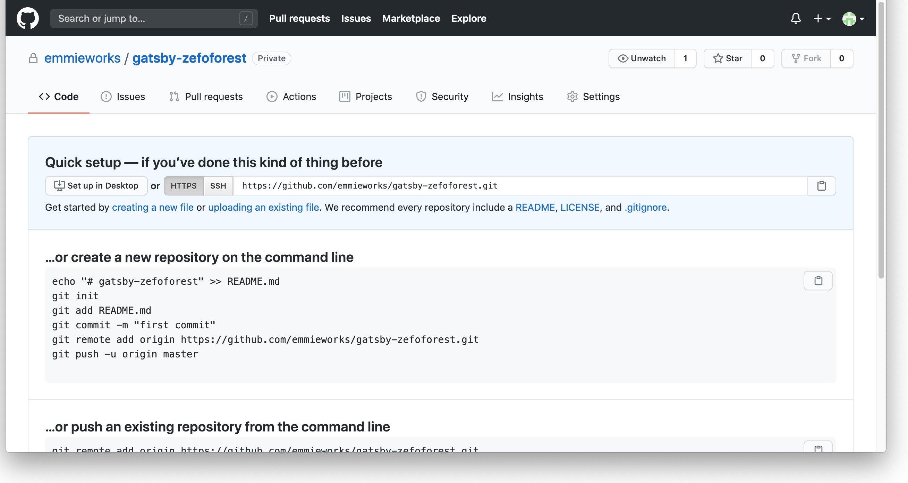
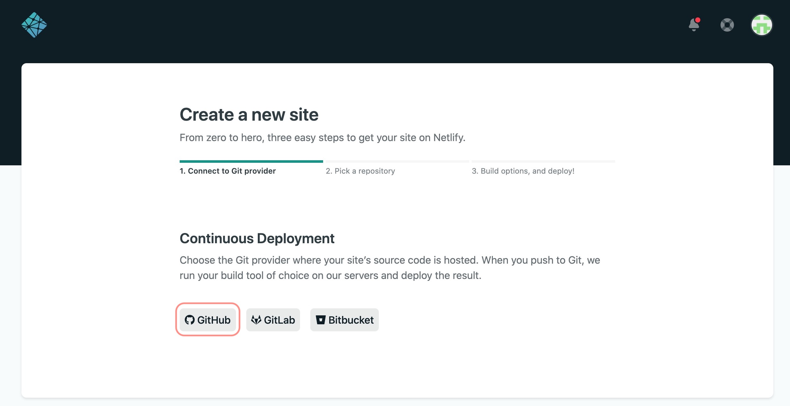
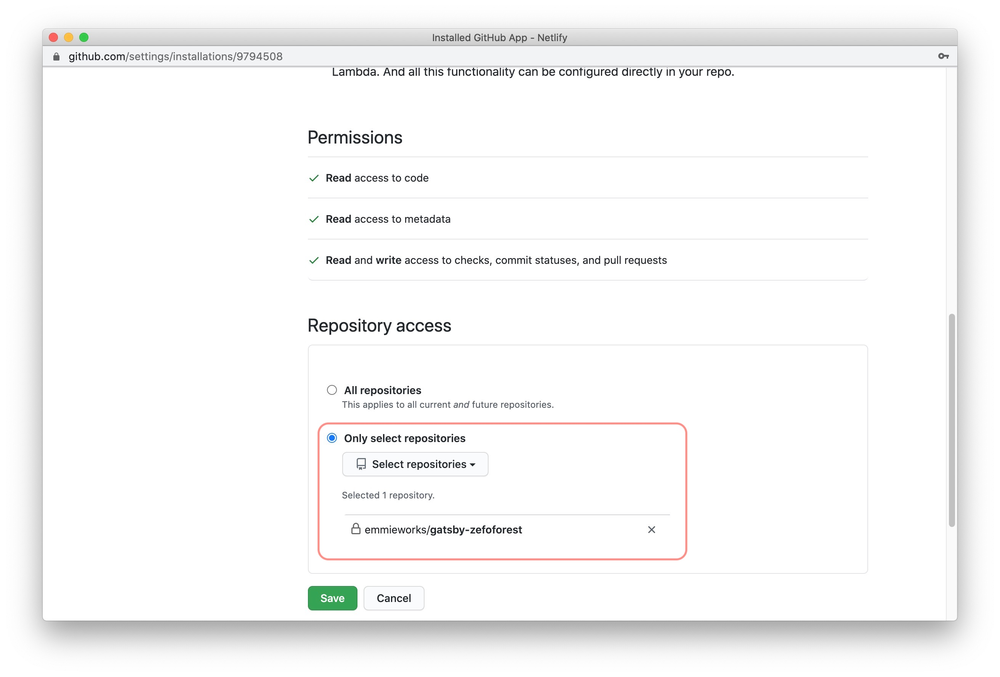
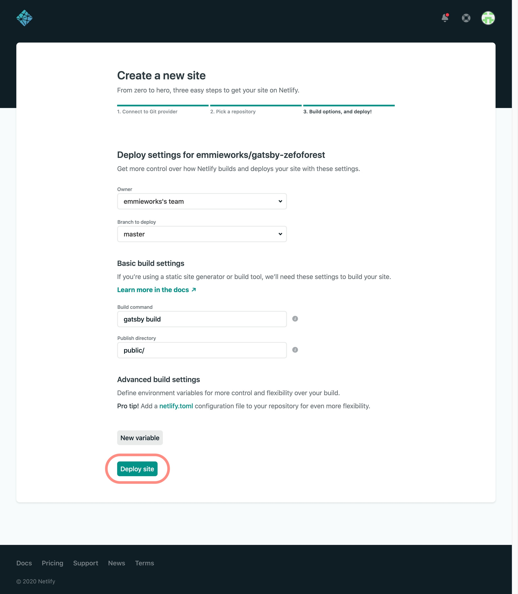
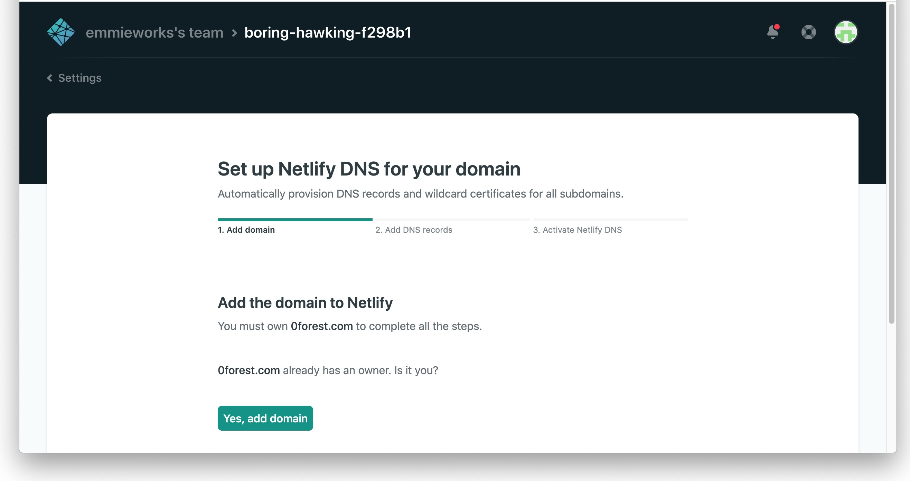
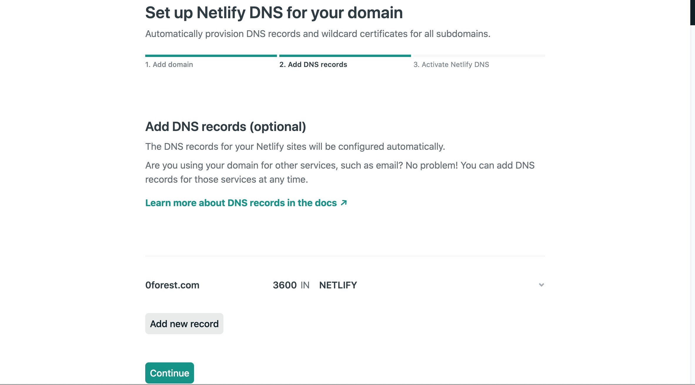
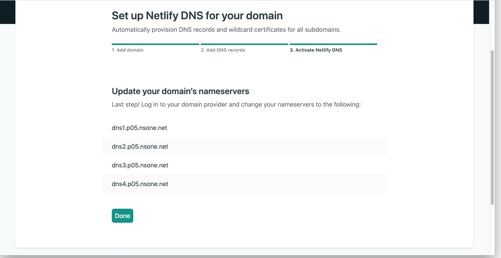
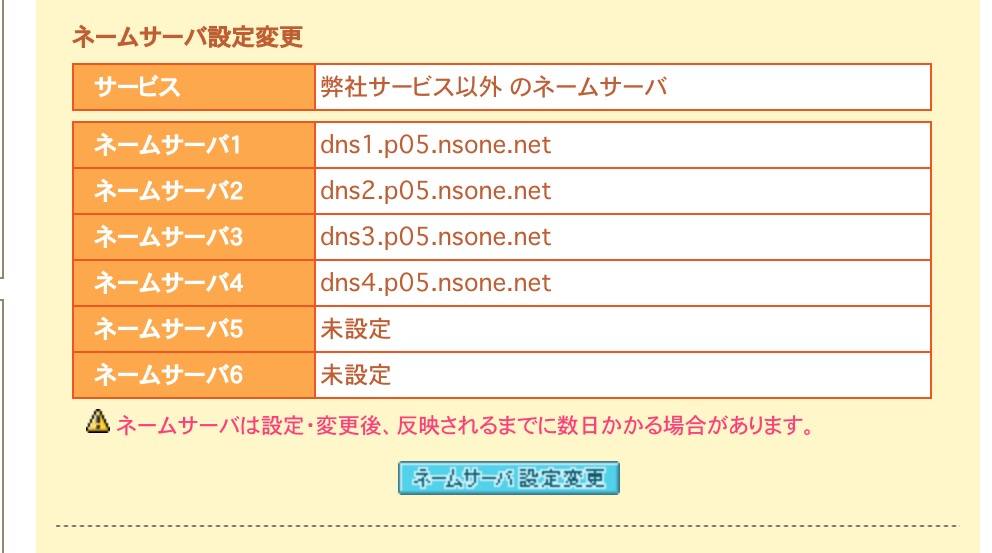

GitHub+Netlifyで
プログラムや記事を更新するとホームページも自動更新できるようになります。

事前準備として、GitHubとNetlifyのアカウント（無料プランでOK）を取得しておきます。

## GitHubリポジトリにプロジェクトをpushする

GitHubで新しいリポジトリを作成します。



プロジェクトフォルダでターミナルを開きます。

スターターブログなどをコピーしてプロジェクトを作った場合、
プロジェクトフォルダ内に「.git」が作成されていることがあります。
その場合は「.git」を削除しておきます。
```
rm -rf .git
```

GitHubのコマンドに従って、リモートリポジトリにプロジェクトをプッシュします。


ローカルリポジトリの新規作成
```
git init
git add -A
git commit -m "first commit"
git remote add origin https://github.com/emmieworks/gatsby-zeroforest.git
```
最後の行のURLはリポジトリごとに変わります。

プロジェクトをプッシュ
```
git push -u origin master
```

これで、GitHubのリポジトリをみると、ファイル群が追加されています。


## Netlifyでサイトを公開

NetlifyにGitHubから新規サイトを登録します。

ログインして、右上の「New Site From Git」というボタンをクリックします。


ログインして、右上の「New Site From Git」ボタンをクリックします。


「GitHub」ボタンをクリックします。


Netlifyと連携させたいリポジトリ（先ほどプッシュしたリポジトリ）を選んで、次に進みます。


リポジトリを選択します。


「Deploy Site」をクリックします。


デプロイが開始します。


デプロイが終わると
`https://xxx.netlify.app`というURLが表示されます。
これがHPのURLになります。

## ドメインを設定する(ムームードメインの場合)

独自ドメインを設定します。

SettingsのDomainから、Custom Domainメニューのドメインを追加します。


DNS Configurationを設定します。


画面に従って、ドメインを設定していきます。






最後にネームサーバーの設定情報が出てくるので、これをドメインのネームサーバーに設定します。


ムームードメインの場合


ムームー管理画面から、該当するドメインを選択＞ネームサーバーの設定変更＞「取得したドメインで使用する ※上級者向け」のネームサーバー１〜４に順に入力して、ネームサーバー設定変更ボタンを押して設定完了です。

## その後、更新するとき

プロジェクトをビルド。
```
gatsby build
```

更新したファイルをリモートリポジトリへプッシュ
```
git add -A
git commit -m "update"
git push
```
Netlifyでデプロイされて、ホームページに変更が反映されます。