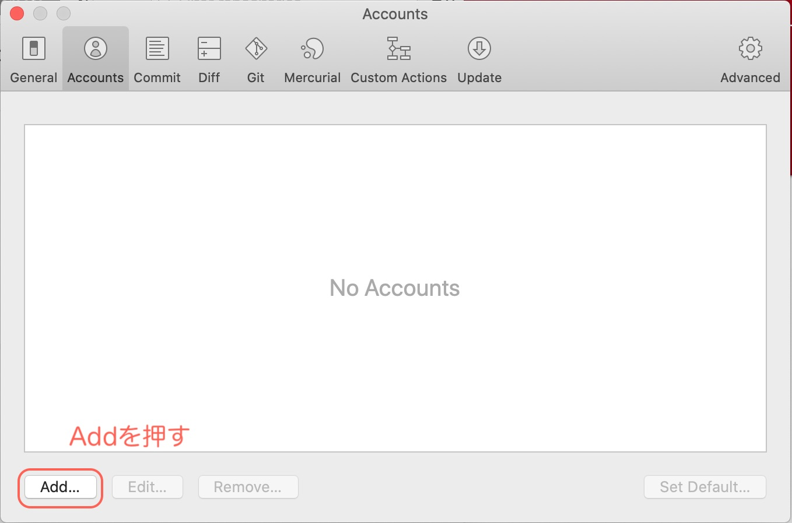
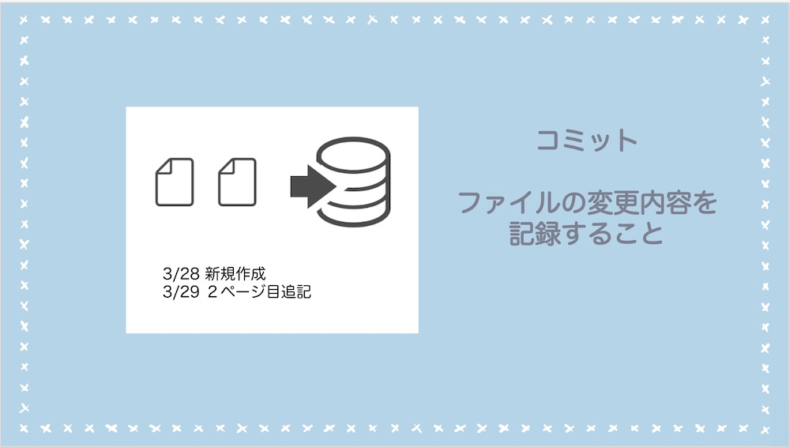
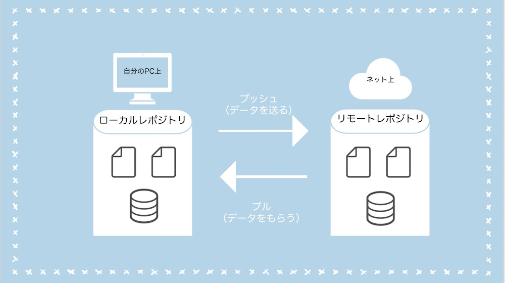
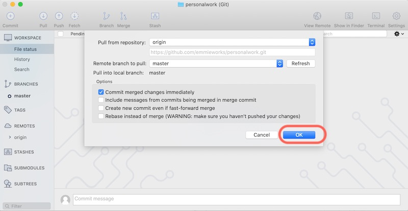
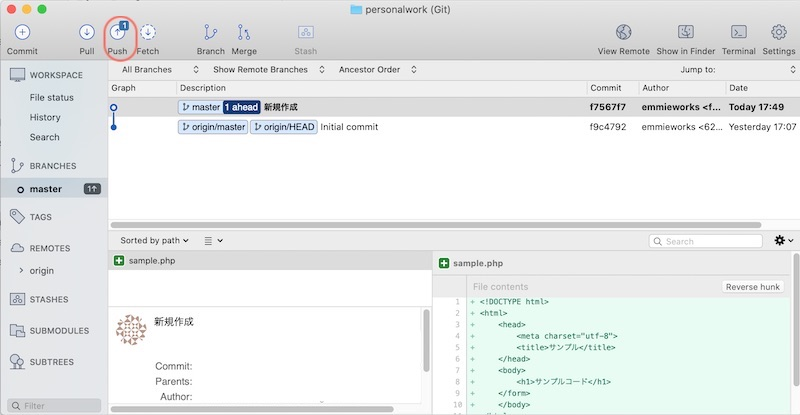
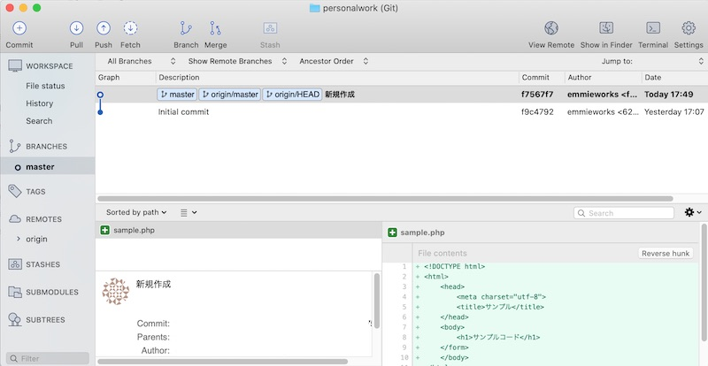

プログラミングではよく使われるバージョン管理。

慣れるまで大変だけど、使えるようになるとめっちゃ便利！です。

今回は、バージョン管理をはじめるための手順を紹介します。

## gitとは？バージョン管理のメリット

gitは、ファイルのバージョン管理システムです。

バージョン管理とはゲームでいう**セーブポイント**。

ゲーム中のセーブポイントのように、作業ごとにその時点の状態を保存しておいて、後から元の状態に戻すことができます。

<div style="position:relative;border:1px solid #91c294;border-radius:6px;padding:25px 30px;margin:30px;font-size:0.9rem;">
  <span style="position:absolute; top: -12px;left: 10px;padding: 5px 20px;background-color: #91c294;border-radius:4px;color:#fff;line-height: 1em;font-size:0.9rem;">
    バージョン管理でできること
  </span>

- ファイルを「誰が」「いつ」「どんな修正を加えたか」を記録に残せる

- 誤って修正した場合に、前に遡ってファイルの状態を戻すことができる

- 複数人で同じファイルを共有、更新ができる。その際、同じ箇所を誤って上書きしてしまうなどのトラブルを避けることができる。
</div>


主には、下記の用途で使われます

- プログラム(HTML、CSSなど）の更新作業

- テキストファイル（小説やブログ記事など）の下書き、編集、校閲作業

- ExcelやPowerpointなどの共有ファイルの履歴管理


バージョン管理システムを使うと、

* 提案書_20200115.txt
* 提案書_20200116.txt

とか

* 提案書_〇〇修正版.xls
* 提案書_〇〇修正版_追記.xls

とか

こんな風にファイルを分けてバックアップを残す必要がなくなります！


## バージョン管理に使うツール

バージョン管理でよく使われるツールは３つです。

1. git
2. GitHub
3. Sourcetree

### Git

git＝バージョン管理を行うためのシステムです。

gitを入れると、自分のPC上にファイルの変更履歴を保管するための場所が用意されて、バージョン管理のための機能が使えるようになります。

### GitHub

GitHubはgitを用いたオンラインサービスです。

web上でファイルや変更履歴を共有できるようになります。

GitHubを使うメリット

* 複数人でプログラムを分担して開発できる
* 他の端末でソースコードや変更履歴を共有できる
* 他サービスと連携して、ホームページやアプリを簡単に公開できる

なお、GitHubにはプライベート機能があり、アップしたファイルの公開／非公開を自分で選ぶことができます。

### SourceTree

SourcetreeはGUIでGitを操作するためのソフトです。

gitを使う際、ターミナルからコマンドを打ち込む必要があります。

Sourcetreeを使うと、画面でファイルの変更履歴を見たり、直接操作できるので、コマンドになれていない初心者に使いやすいです。


## Git、GitHub、SoureTreeのはじめかた【Macユーザー向け】

Git、

ここではMac向けに解説しています。

### gitを導入する

ターミナルを起動して、以下のコマンドを入力します。

```
git --version
```

確認画面が表示されて「コマンドライン・デベロッパー・ツール」をインストールするかどうか聞かれますので、インストールを行います。


```
git --version
```
これで、バージョンが表示されれば、ターミナルよりgitが使えるようになります。


### GitHubを導入する

<a href="https://github.co.jp/" target="_blank" rel="noopener noreferrer">GitHubの公式サイト</a>


ID,メールアドレス,パスワードを入力して、次に進みます。


プランは「個人（Free）」を選びます。


メールが届くので、メールで本人確認を行い、登録完了させます。


### SourcetreeにGitHubを連携する

<a href="https://www.Sourcetreeapp.com/" target="_blank" rel="noopener noreferrer">Sourcetreeの公式サイト</a>

Downloadボタンを押して、SourceTreeをインストールします。

Soucetreeを開いたら、GitHubのアカウントをSourcetreeに追加します。


アカウント追加ボタンを押します。



Webブラウザが立ち上がって、GitHubとの連携画面が表示されます。

「Authorize atlassian」をクリックします。


これで、アカウントが追加されました。


## 覚えておきたいgitの基本用語４つ


【バージョン管理でよくつかう用語】

| 用語 | 説明 |
| ---- | ---- |
| リポジトリ | 変更履歴の保管場所 |
| コミット| ファイルの変更を記録する|
| プッシュ| クラウド上にデータを送る|
| プル| クラウド上からデータをもらう|

まずこれだけ覚えればとりあえず使い始めることができます。

### リポジトリ

リポジトリ　＝ データの変更履歴を保管する場所


リポジトリは変更履歴を保管する場所です。

リポジトリには２種類あります。

* 自分のPC上：ローカルリポジトリ

* インターネット上：リモートリポジトリ


### コミット

コミット　＝ ファイルの変更履歴をリポジトリに保存すること



ただファイルを保存しただけでは、変更履歴は記録されません。

セーブポイントとして保存したいところ（作業が一段落したところで）、自分で作業内容を入力して記録します。

この変更内容の記録のことをコミットといいます。


### プルとプッシュ



プル ＝ リモートリポジトリの内容をローカルリポジトリに反映すること

プッシュ ＝ ローカルリポジトリの内容をリモートリポジトリに反映すること


【再掲】バージョン管理でよくつかう用語

| 用語 | 説明 |
| ---- | ---- |
| リポジトリ | 変更履歴の保管場所。<br />リモートレポジトリ（Web上）とローカルレポジトリ(自分のPC上)がある。 |
| コミット | ファイルの変更をリポジトリに記録する |
| プッシュ | ローカルレポジトリ(自分のPC上)からリモートレポジトリ（Web上）にデータを送る |
| プル | リモートレポジトリ（Web上）からローカルレポジトリ(自分のPC上)にデータをもらう |


## 基本の使い方

### 新しくプロジェクトをはじめるとき

#### 1.新規リポジトリ作成

プロジェクトの始めに、GitHubでレポジトリ（変更履歴を管理する場所）を作ります。


レポジトリの作成が完了したところ。

右の「Clone or Download」にリポジトリのURLが出てくるので、`https://github〜〜`のURLをコピーします。


#### 2. クローン

続いて、GitHub上のリモートリポジトリの内容を丸ごとローカルのPCにコピーします。

※この作業をクローン（clone）と呼びます。

Sourcetree上部の「New」から「Clone from URL」をえらびます。


リモートレポジトリの情報を入力します。


* Source URL：先ほどGitHubでコピーしたURL

* Destination Path：自分のPC内の作業フォルダ

入力したら、Cloneを押します。


これで、新しくプロジェクトを始める設定は完了です。

プロジェクトフォルダの中に「.git」という隠しフォルダが追加されています。


<div style="position:relative;border:1px solid #91c294;border-radius:6px;padding:25px 30px;margin:30px;font-size:0.9rem;">
  <span style="position:absolute; top: -12px;left: 10px;padding: 5px 20px;background-color: #91c294;border-radius:4px;color:#fff;line-height: 1em;font-size:0.9rem;">
    バージョン管理したくないファイルはどうするの？
  </span>

  .gitignoreを作って、バージョン管理しないファイルを追記します。

```
# ファイル名を指定
file.txt

# ディレクトリを指定
directory/

# テキストファイルを除外
*.txt
```

</div>

### ふだんの作業でやること

#### 1. プル：リモートリポジトリからデータを同期させる（チームで開発しているときのみ）

複数人で、同じプログラムを編集している場合には、

自分が作業に入る前に、ローカルPC上のデータをリモート上データと同期させます。

個人の場合は、自分以外にファイルを更新しないので、この作業は飛ばしてOKです。

SourceTreeの「Pull(プル)」ボタンを押します。



#### 2.ファイルを更新する

プログラムなどを編集します。
試しに、sample.phpを作成して入れてみました。


すると、Sourcetree上では変更されたファイルが表示されます。


#### 3. コミットする

 作業が終わったら、コミットをします。（作業単位にコミットが基本）

ファイルにチェックを入れます。
複数ファイルをまとめて選ぶこともできます。


作業内容をメッセージ欄を入れて、コミットボタンを押します。


#### 4. プッシュ：ローカルの変更内容をリモートリポジトリへアップロードする

作業が終わったら、PC上の内容をネット上に反映します。

Pullボタンを押します。



OKを押します。


完了すると、origin/masterが一番上の行に移動します。




## Gitを始めた方におすすめの記事の記事


* [【Git】ブランチの使い方とSourceTreeでの操作方法](/git-branch/)

以上、バージョン管理の基本についてご紹介でした。