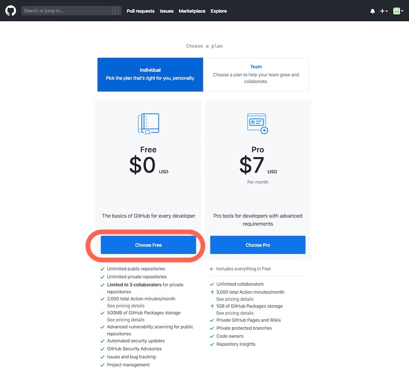
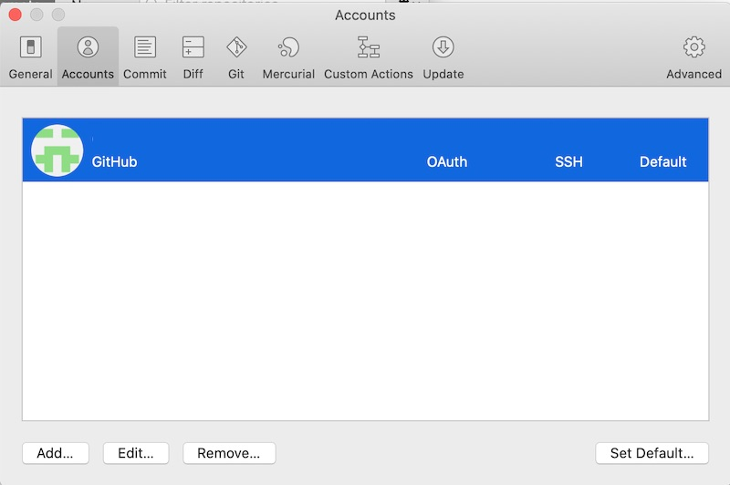
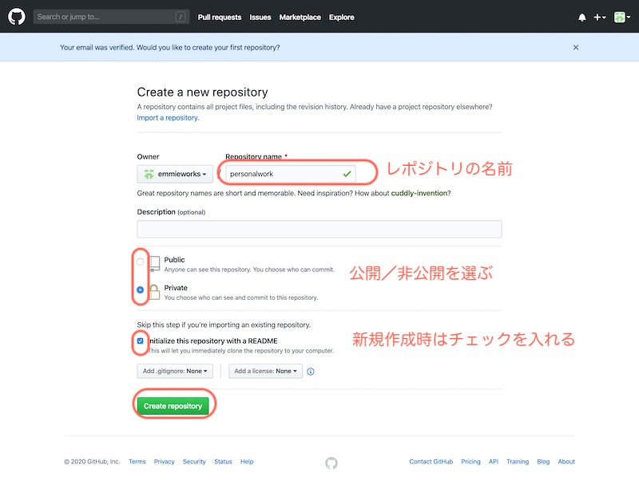
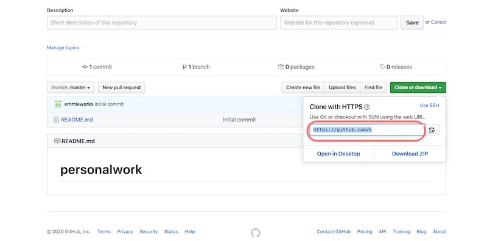
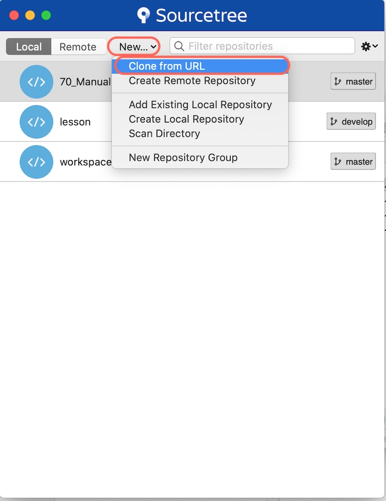
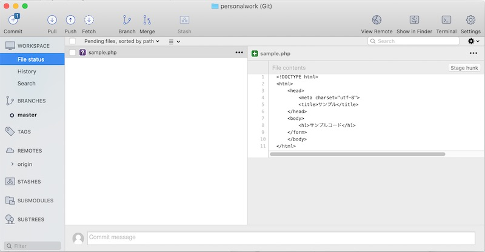
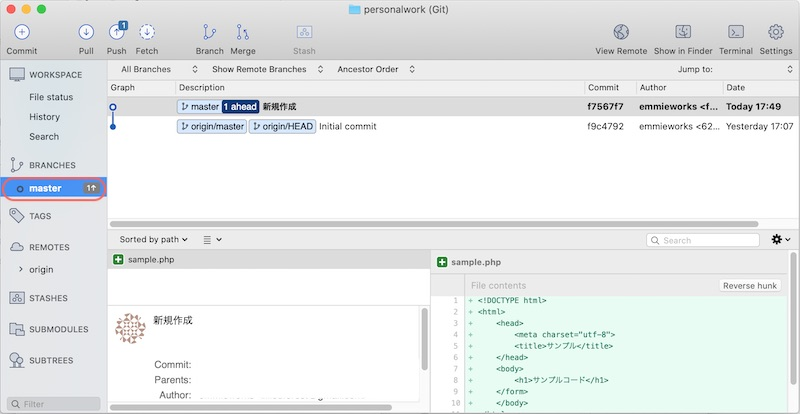

プログラミングではよく使われるバージョン管理について、導入方法と基本の使い方を紹介しています。

    バージョン管理のはじめかた

1. [gitとSourcetreeをインストールして、バージョン管理をはじめる](/install-sourcetree/)
2. [GitHubインストールといつものプロジェクトでの使い方]（この記事）
3. [間違えて保存・コミットしたときに元に戻す方法まとめ](/git-rebase/)
4. [【gitでバージョン管理】ブランチを使って、履歴を分ける方法](/git-branch/)
5. [GitHubでソースコードをブログに載せる方法まとめ](/github-gist-wordpress/)

##  GitとGitHubの違い

git＝バージョン管理を行うためのシステムです。

gitを入れると、自分のPC上にファイルの変更履歴を保管するための場所が用意され、バージョン管理の機能が使えるようになります。

GitHub＝gitを用いたオンラインサービスです。

web上でファイルや変更履歴を共有できるようになります。

    GitHubを使うメリット

* 複数人でプログラムを分担して開発できる

* 他の端末でソースコードや変更履歴を共有できる

* 他サービスと連携して、ホームページやアプリを簡単に公開できる

ちなみにGitHubにはプライベート機能があり、アップしたファイルの公開／非公開を自分で選ぶことができます。

個人的には、GitHubのありがたみ感じています。

① GitHubからプログラムを連携して、ホームページなどに自動で公開できるようになる
（html/CSSやwordpressテーマのFTPアップロードの手間を省く）

② GitHubでプログラムを管理しておくと、楽にブログに簡単にソースコードを掲載できる

## GitHubのはじめかた

まず事前準備として、GitとSourceTreeをインストールしておきます。

* [GitとSourceTreeのインストール方法](/install-sourcetree/)

### GitHubの登録

GitHubのアカウントを登録します。
<a href="https://github.co.jp/" target="_blank" rel="noopener noreferrer">GitHubの公式サイト</a>

ID,メールアドレス,パスワードを入力して、次に進みます。

プランは「個人（Free）」を選びます。

メールが届くので、メールで本人確認を行い、登録完了させます。

### SourcetreeにGitHubを連携する

<a href="https://www.Sourcetreeapp.com/" target="_blank" rel="noopener noreferrer">Sourcetreeの公式サイト</a>

Downloadボタンを押して、SourceTreeをインストールします。

Soucetreeを開いたら、GitHubのアカウントをSourcetreeに追加します。

アカウント追加ボタンを押します。

Webブラウザが立ち上がって、GitHubとの連携画面が表示されます。

「Authorize atlassian」をクリックします。

これで、アカウントが追加されました。

## 覚えておきたいgitの基本用語

【バージョン管理でよくつかう用語】

| 用語 | 説明 |
| ---- | ---- |
| リポジトリ | 変更履歴の保管場所 |
| コミット| ファイルの変更を記録する|
| プッシュ| クラウド上にデータを送る|
| プル| クラウド上からデータをもらう|

まずこれだけ覚えればとりあえず使い始めることができます。

### リポジトリ

リポジトリ　＝ データの変更履歴を保管する場所

リポジトリは変更履歴を保管する場所です。

リポジトリには２種類あります。

* 自分のPC上：ローカルリポジトリ

* インターネット上：リモートリポジトリ

### コミット

コミット　＝ ファイルの変更履歴をリポジトリに保存すること

ただファイルを保存しただけでは、変更履歴は記録されません。

セーブポイントとして保存したいところ（作業が一段落したところで）、自分で作業内容を入力して記録します。

この変更内容の記録のことをコミットといいます。

### プルとプッシュ

プル ＝ リモートリポジトリの内容をローカルリポジトリに反映すること

プッシュ ＝ ローカルリポジトリの内容をリモートリポジトリに反映すること

【再掲】バージョン管理でよくつかう用語

| 用語 | 説明 |
| ---- | ---- |
| リポジトリ | 変更履歴の保管場所。 リモートレポジトリ（Web上）とローカルレポジトリ(自分のPC上)がある。 |
| コミット | ファイルの変更をリポジトリに記録する |
| プッシュ | ローカルレポジトリ(自分のPC上)からリモートレポジトリ（Web上）にデータを送る |
| プル | リモートレポジトリ（Web上）からローカルレポジトリ(自分のPC上)にデータをもらう |

## 基本の使い方：新しくプロジェクトをはじめるとき

### 1.新規リポジトリ作成

プロジェクトの始めに、GitHubでレポジトリ（変更履歴を管理する場所）を作ります。

レポジトリの作成が完了したところ。

右の「Clone or Download」にリポジトリのURLが出てくるので、`https://github〜〜`のURLをコピーします。

### 2. クローン：リモートリポジトリの内容をローカルにコピー

続いて、GitHub上のリモートリポジトリの内容を丸ごとローカルのPCにコピー（＝クローン）します。

Sourcetree上部の「New」から「Clone from URL」をえらびます。

リモートレポジトリの情報を入力します。

* Source URL：先ほどGitHubでコピーしたURL

* Destination Path：自分のPC内の作業フォルダ

入力したら、Cloneを押します。

これで、新しくプロジェクトを始める設定は完了です。

プロジェクトフォルダの中に「.git」という隠しフォルダとReadme.mdが追加されています。

## ふだんの作業でやること

### 1. ファイルを更新する

プログラムなど使っているファイルを編集します。

試しに、sample.phpを作成して入れてみました。

Sourcetree上では変更されたファイルが表示されます。

    チームで開発しているとき

複数人で、同じプログラムを編集している場合には、自分が作業に入る前に、ローカルPC上のデータをリモート上データと同期させます。

個人の場合は、自分以外にファイルを更新しないので、この作業は飛ばしてOKです。

SourceTreeの「Pull(プル)」ボタンを押します。

### 2. コミット：作業を記録する

作業が終わったら、コミットをします。
作業ごとにコミットしとおくと、後から見直したり、修正しやすいです。

ファイルにチェックを入れます。
複数ファイルをまとめて選ぶこともできます。

作業内容をメッセージ欄を入れて、コミットボタンを押します。

### 3. プッシュ：ローカルの変更内容をリモートリポジトリへアップロードする

作業が終わったら、PC上の内容をネット上に反映します。

Pullボタンを押します。

OKを押します。

完了すると、origin/masterのタグが一番上の行に移動して、masterのタグと揃います。

master　→ローカルリポジトリの状態

origin/master　→ リモートリポジトリの状態

## まとめ：ターミナル上で操作するときのgitコマンドまとめ

ターミナルでコマンドをうつことでも、同様の操作ができます。

| 用語 | コマンド | 補足 |
| ---- | ---- | ---- |
| 新規リポジトリ作成 | git init |  |
| リモートからのクローン| git clone https://github.com/XXXX/XXXXXX.git | |
| プル | git pull | |
| ファイルをインデックスに追加| git add ファイル名 | git add -A ( git add --all )で全ファイル追加 |
| コミット | git commit -m "コミットメッセージ" | |
| プッシュ | git push origin master | |

続き＞＞ [ランチの使い方とSourcetreeでの操作方法](/git-branch/)