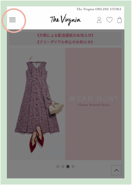
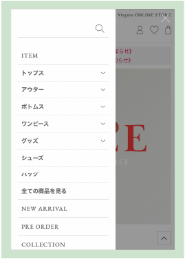

## ハンバーガーメニューとは

スマホなどで、ホームページを表示した時に見える３本線のこと。

この３本線が、ハンバーガーのように見えることから、ハンバーガーメニューと呼ばれています。



クリックすると、メニューが表示されます。



参考サイト：[The Virginia](https://virgnia.jp/)


【ハンバーガーメニューのメリット】

* スマホなどの小さい画面で、コンテンツの表示エリアを確保できる。

* コンテンツとは別に、メニューエリアを確保できるので、メニューをクリックしやすい。


【ハンバーガーメニューのデメリット

* スマホに慣れていない人は、３本線がメニューだと分からない

* 一度メニューボタンを押さないと、メニューの中身が見れない


今回は、ハンバーガーメニューの作り方をメモしておきます。


## ハンバーガーメニューの作り方

### DEMO
<iframe height="400" style="width: 100%;" scrolling="no" title="ハンバーガーメニューサンプル" src="https://codepen.io/filledforest/embed/QWyoeLv?height=400&theme-id=light&default-tab=css,result" frameborder="no" allowtransparency="true" allowfullscreen="true">
  See the Pen <a href='https://codepen.io/filledforest/pen/QWyoeLv'>ハンバーガーメニューサンプル</a> by Emi
  (<a href='https://codepen.io/filledforest'>@filledforest</a>) on <a href='https://codepen.io'>CodePen</a>.
</iframe>

サイズを×0.5にして、横幅を広くすると、PC用の表示になります。
PC版では、メニューボタンがなくなり、左側にロゴ、右側にメニューが並びます。


### メニューボタン

```css
#navbtn{
  position: fixed;
  top: 15px;
  right: 15px;
  padding: 0;
  outline: none;
  border: none;
  background: none;
  width: 30px;
  height: 20px;
  cursor: pointer;
}
```


```css
/* 高さ1pxの線を上下に表示 */
#navbtn::before,
#navbtn::after{
  content : '';
  display: block;
  height: 1px;
  background-color: #333333;
  transform: translateY(10px);
  transition: 0.3s ease-in-out;
}
```
`#navbtn::before`で上の線、`#navbtn::after`で下の線を作っています。

高さ1pxの線をtransform: translateY(10px)で上下に10px移動させています。

transitionをつけているので、切り替わる際にアニメーションがつきます。

```css
/* 高さ1pxの線を中央に表示 */
#navbtn::before{
  transform: translateY(-10px);
  box-shadow: 0 10px #333333;
}
```

`#navbtn::before`に`box-shadow`をつけることで、中央の線を表示させています。（上の線の陰が真ん中の線になります。）

### 閉じるボタン

```css
.open #navbtn{
  z-index: 100;
}
.open #navbtn::before{
  transform: rotate(-45deg);
  box-shadow: none;
}
.open #navbtn::after{
  transform: rotate(45deg);
  box-shadow: none;
}
```
もともとあった３本線のメニューから、beforeとafterの上下線を45度ずつ傾けて、×にしています。

box-shadowをnoneにすることで、中央線を一本なくしています。

### メニュー部分

```css
.nav{
    position: fixed;
    top: 0;
    left: 0;
    width: 100%;
    height: 100vh;
    background: rgba(0,0,0,0.9);
    color: #ffffff;
    display: flex;
    justify-content: center;
    align-items: center;
  }
```

flexにして、中央表示をしています。

### メニューの表示切り替え

```css
.nav{
  /* 初期は非表示 */
  visibility: hidden;
  opacity: 0;
  /* ふわっと表示 */
  transition: 0.5s ease-in-out;
}
```

```css
.open .nav{
  visibility: visible;
  opacity: 1;
}
```

### JavaScriptでopenクラスを付与

メニューボタンを押すと、htmlにopenクラスが付与されるようにします。

```JavaScript
document.getElementById("navbtn").onclick = function(){
  document.querySelector('html').classList.toggle('open');
}
```

## いろいろなハンバーガーメニュー実装サンプル

### ボタンのアニメーション

* [ひたすらハンバーガーアイコンを作ったので9種のソースを公開します！](https://liginc.co.jp/180293)

* [【CSS】ハンバーガーメニュー実装サンプル集（クリック時のエフェクトも集めました）](https://125naroom.com/web/2958)

* [CSSで実装するハンバーガーメニュークリック時のエフェクト 10＋](https://www.nxworld.net/tips/12-css-hamburger-menu-active-effect.html)


### 右上にボタン＋右からスライド

<iframe height="400" style="width: 100%;" scrolling="no" title="ハンバーガーメニュー（右から左へスライド）" src="https://codepen.io/filledforest/embed/OJMGdNO?height=400&theme-id=light&default-tab=css,result" frameborder="no" allowtransparency="true" allowfullscreen="true">
  See the Pen <a href='https://codepen.io/filledforest/pen/OJMGdNO'>ハンバーガーメニュー（右から左へスライド）</a> by Emi
  (<a href='https://codepen.io/filledforest'>@filledforest</a>) on <a href='https://codepen.io'>CodePen</a>.
</iframe>

【解説】
画面右の外側（left:100%）にメニューを配置しておきます。

```css
.nav{
  left: 100%;
  transition: left 0.5s;
}
```

`transition:left`で
leftの値にアニメーションをつけて変化させます。

メニューを開いた時に、leftを0にして、画面左端に持ってきます。
```css
.open nav{
  left:0;
}
```

初期で、画面外に配置したオーバーレイが表示されないようにしています。
```css
html,body{
    overflow-x: hidden;
}
```

### 左上にメニュー＋左からスライド

<iframe height="400" style="width: 100%;" scrolling="no" title="ハンバーガーメニュー（左から右へスライド）" src="https://codepen.io/filledforest/embed/PoZgVzO?height=400&theme-id=light&default-tab=css,result" frameborder="no" allowtransparency="true" allowfullscreen="true">
  See the Pen <a href='https://codepen.io/filledforest/pen/PoZgVzO'>ハンバーガーメニュー（左から右へスライド）</a> by Emi
  (<a href='https://codepen.io/filledforest'>@filledforest</a>) on <a href='https://codepen.io'>CodePen</a>.
</iframe>

【解説】
画面左の外側（left:-100%）にメニューを配置しておきます。

```css
.nav{
  left: -100%;
  transition: left:0.5s;
}

```

### 中央にボタン＋上からスライド
<iframe height="400" style="width: 100%;" scrolling="no" title="gOPyqmX" src="https://codepen.io/filledforest/embed/gOPyqmX?height=400&theme-id=light&default-tab=css,result" frameborder="no" allowtransparency="true" allowfullscreen="true">
  See the Pen <a href='https://codepen.io/filledforest/pen/gOPyqmX'>gOPyqmX</a> by Emi
  (<a href='https://codepen.io/filledforest'>@filledforest</a>) on <a href='https://codepen.io'>CodePen</a>.
</iframe>

## WordPressでハンバーガーメニューを実装するには？？
WordPressでは、グローバルメニュー用のHTMLコードに合わせて、CSSを設定する必要があります。

詳しくは[【WordPress】プルダウンメニューのデザインを整える](/wordpress-pulldown-menu)をどうぞ。