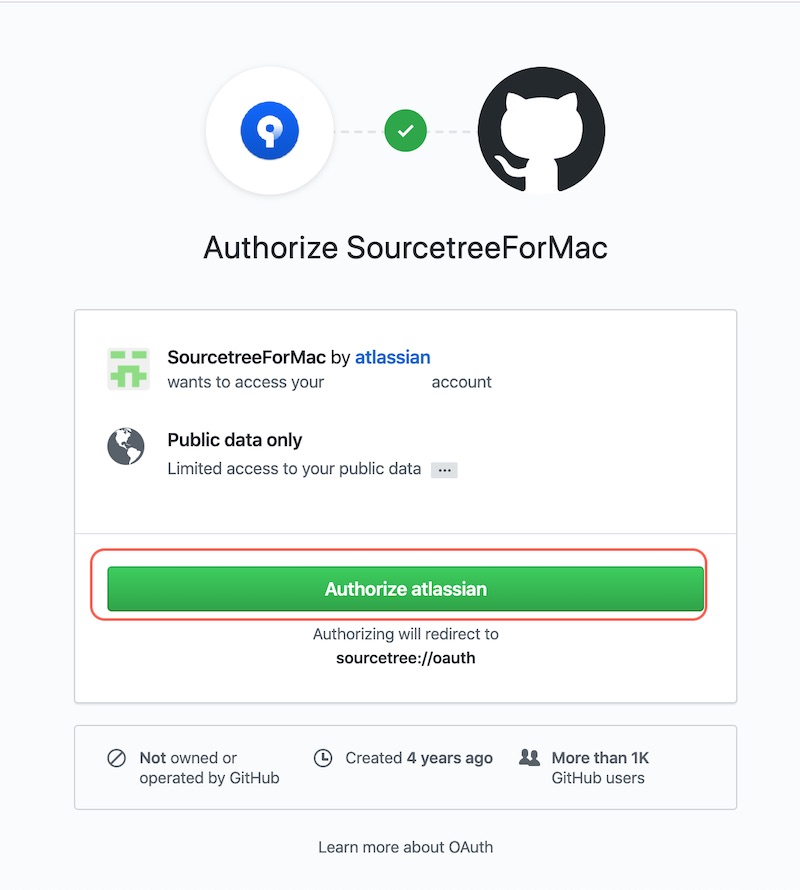
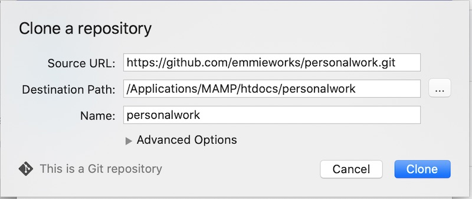

大規模な開発なら必ず行なっているバージョン管理。
とはいえ、個人開発でも、プログラムやテキストの更新履歴を管理したいこともあるのではないでしょうか。

でも、バージョン管理って専門用語ばかりでわかりにくいんですよね…

今回は、初心者がgitを使うための知識と手順をステップバイステップで解説しました。

## gitとはバージョン管理のサービス

gitは、システム開発で使われるバージョン管理システムです。

バージョン管理とはゲームでいう**セーブポイントみたいなもの**。

ファイルにセーブポイントをいくつか作っておくことで、後からその状態に簡単に戻れるようになります。

gitを使うメリット

* コードやファイルの変更を記録する
* 変更履歴を確認する
* ファイル内容を任意の時点まで戻すことができる

ちなみに、ソースコード以外のファイルも管理できます。

GitHubはgitを用いたオンラインサービスです。
gitはローカル環境（自分のPC上のみ）ですが、GitHubはweb上でソースコードや変更履歴を共有できるようになります。

GitHubを使うメリット * 自分の書いたプログラムを世界に公開できる

* クラウド上にソースコードと変更履歴を保管できる
* 他の端末でソースコードや変更履歴を共有できる

なお、GitHubにはプライベート機能があり、アップしたファイルの公開／非公開を自分で選ぶことができます。
以前は、無料版では使えなかったのですが、最近は使えるようになったみたいです☺️

## 覚えておきたいgit基本用語

バージョン管理には専用用語があります。
はじめて個人で使うときには、まずこれだけ覚えればいいかと。

 リポジトリ：変更履歴の保管場所
 コミット：ファイルの変更を記録する
 プッシュ：クラウド上にデータを送る
 プル：クラウド上からデータをもらう

### リポジトリ

リポジトリ：データの変更履歴を保管する場所

リポジトリは変更履歴を保管する場所です。

自分のPC上：ローカルリポジトリ
インターネット上：リモートリポジトリ

 と呼びます。

### コミット

コミット＝ ファイルの変更履歴をリポジトリに保存すること

ただファイル保存しただけでは、変更履歴は記録されません。
自分がセーブポイントとして保存したいところ(作業が一段落したところ)で、自分で作業内容を入力して記録します。

### プルとプッシュ

プル ＝ リモートリポジトリの内容をローカルリポジトリに反映すること

作業を始める時に、最新版のデータを自分のPC上にダウンロードします。

プッシュ ＝ ローカルリポジトリの内容をリモートリポジトリに反映すること

自分のPC上でファイルを編集した後、ファイルと変更履歴をweb上にアップロードイメージです。

自分のPCからみて、
**プッシュ（push）が「送る（押し出すイメージ）」、**
**プル（pull）が「もらう（引っ張ってくるイメージ）」**
です。

バージョン管理で出てくる用語

* リポジトリ ： 変更履歴の保管場所。リモートレポジトリ（Web上）とローカルレポジトリ(自分のPC上)がある。
* コミット ： 変更を記録する
* プッシュ ： ローカルレポジトリ(自分のPC上)からリモートレポジトリ（Web上）にデータを送る
* プル： リモートレポジトリ（Web上）からローカルレポジトリ(自分のPC上)にデータをもらう

## GitHubの始め方【Mac導入編】

使うもの

* GitHub
* Sourcetree

### GitHubを導入する

<a href="https://github.co.jp/" target="_blank" rel="noopener noreferrer">GitHubの公式サイト</a>

ID,メールアドレス,パスワードを入力して、次に進みます。

プランは「個人（Free）」を選びます。

メールが届くので、メールで本人確認を行い、登録完了させます。

### SourcetreeにGitHubを連携する

SourcetreeはGitを簡単に操作するためのツールです。

gitを使う際、コミットやプッシュなどをコマンドで打ち込む必要があります。コマンドに慣れていないと分かりにくいです。
そこで、Sourcetreeを使うと、画面でファイルの変更履歴を見れたり、操作できるので初心者にも使いやすいです。

<a href="https://www.Sourcetreeapp.com/" target="_blank" rel="noopener noreferrer">公式サイトからSourcetreeをインストール</a>します。

Soucetreeを開きます。

GitHubのアカウントを、Sourcetreeに追加していきます。

アカウント追加ボタンを押します。

Webブラウザが立ち上がって、GitHubとの連携画面が表示されます。

「Authorize atlassian」をクリックします。

これで、アカウントが追加されました。

## GithHub使い方

### 1.新規リポジトリ作成

プロジェクトの始めに、GitHubでレポジトリ（変更履歴を管理する場所）を作ります。

レポジトリの作成が完了したところ。

右に共有用のURLが出てくるので「https://github〜〜」のURLをコピーします。

### 2. クローン

続いて、GitHub上のリモートリポジトリの内容を丸ごとローカルのPCにデータをコピー（クローン）してきます。

クローン（clone）とは このコピーする作業をクローン（clone）と呼びます。

GitHubにあるリモートリポジトリの内容を、ローカルPC上に複製する作業のことです。

通常プロジェクトの最初に行います。

Sourcetreeの上部にある「New」から「Clone from URL」をえらびます。

リモートレポジトリの情報を入力します。

* Source URL：先ほどGitHubでコピーしたURL
* Destination Path：自分のPC内の作業フォルダ

入力したら、Cloneを押します。

## ふだんの作業でやること（プル→作業→コミット→プッシュ）

### 1.リモートレポジトリの最新データを、ローカルPCにダウンロードする（プル）

複数の人で、同じプログラムを編集している場合には、古いデータで作業してしまう可能性があるので、自分が作業に入る前に必ずやります。

個人の場合は、自分以外にファイルを更新しないので、プルをしても変更がないと思います。

例えば、他の端末でも作業していて、更新内容がリモートレポジトリに反映されているときなどは、ローカルPC上のデータを、リモート上データと同期させます。

### 2.適宜ファイルを更新する

プログラムなどを編集します。
試しに、sample.phpを作成して入れてみました。

すると、Sourcetree上では変更されたファイルが表示されます。

### 3.ファイルの変更を記録（コミット）する

 作業が終わったら、その作業ごとにコミットをしていくのが基本。

 コミット＝作業単位です

ファイルにチェックを入れます。（複数ファイルをまとめて選ぶこともできます）

作業内容をメッセージ欄を入れて、コミットボタンを入れます。

コミットが完了すると、変更履歴が見えるようになります。

###4.ローカルの変更内容をリモートリポジトリへアップロードする（プッシュ）

作業が終わったら、PC上の内容をネット上に反映します（プル）。

Pullボタンを押します。

OKを押します。

完了すると、履歴に反映されます。

## まとめ

* Gitはシステム開発で使われるバージョン管理システム
* GitHubとSourcetreeを連携してバージョン管理ができる

以上、GitHubの導入から基本的な使い方までのご紹介でした。