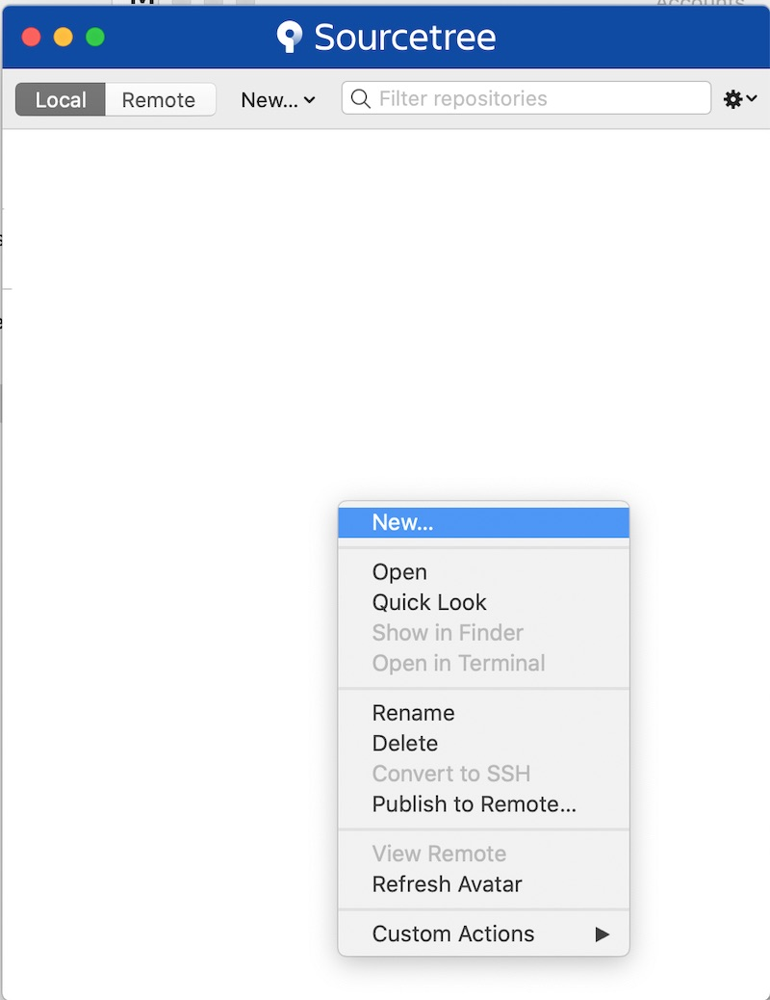
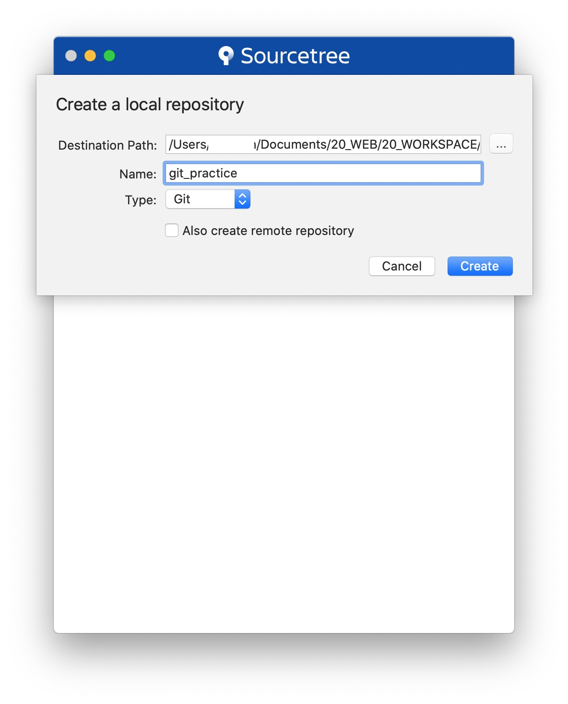

「**バージョン管理**」ってご存知ですか。

ファイルの更新履歴を残しておいて、
「いつ、どう編集したか」を確認したり、

いざというとき前の状態に戻せるツールです。


* ファイル保存しちゃったけど、昨日の状態に戻したい…

* ファイルを更新したい。でも、元の状態も使うかもしれないから、ファイルを複製しとこう…

こんな悩みも、バージョン管理があれば解決できます。

特に開発では何度もプログラムに編集が入るので、何をどう修正したか分かるととっても便利です。

私はgitを使いはじめて、はじめは用語が分からなかったり、
作業を前の状態に戻そうと思ったら、全部消えてしまったりと、戸惑うこともありましたが、少しずつ使い方に慣れてきました。

そこで、今回はバージョン管理をはじめる方法を紹介します。

<div class="border-box">

<span>こんな方にオススメです。</span>

* WEBデザイナーやプログラマーで、htmlやCSSをバージョン管理したい人
* ブログ記事など、文章の編集・校閲履歴を残したい人
* ファイルのバックアップを残したい人

</div>

なお、今回は個人で使う機能に絞って紹介しています。

チームで使うときには、同じ箇所を編集してしまった時の対応や、変更箇所のレビュー依頼などができますが、その説明は割愛します。


<div class="related-posts">
    <span>バージョン管理の基本</span>

1. gitとSourcetreeをインストールして、バージョン管理をはじめる（この記事）
2. [GitHubの導入からプロジェクトでの基本の使い方](/git-install/)
3. 【gitでバージョン管理】前の状態にファイルを戻す方法（準備中）
4. [【gitでバージョン管理】ブランチを使って、履歴を分ける方法](/git-branch/)
5. [GitHubでソースコードをブログに載せる方法まとめ](/github-gist-wordpress/)

</div>

ちょっと専門用語が多くて、慣れるまで時間がかかりますが、更新箇所を振り返ったり、いざと言うときに前に戻せる安心感があります。

プログラミングで多くのファイルを更新する方にはぜひ取り入れて見てほしいです。


## バージョン管理のメリット

gitは、ファイルのバージョン管理システムです。

バージョン管理とはゲームでいう**セーブポイント**。

ゲーム中のセーブポイントのように、作業ごとにその時点の状態を保存しておいて、後から元の状態に戻すことができます。

<div class="title-box">
  <span>
    バージョン管理でできること
  </span>

- ファイルを「誰が」「いつ」「どんな修正を加えたか」を記録に残せる

- 誤って修正した場合に、前に遡ってファイルの状態を戻すことができる

- 複数人で同じファイルを共有、更新ができる
</div>


バージョン管理は、こんな時に使われます

- プログラム(HTML、CSSなど）の更新作業

- テキストファイル（小説やブログ記事など）の下書き、編集、校閲作業

- ExcelやPowerpointなどの共有ファイルの履歴管理


バージョン管理システムを使うと、

* 提案書_20200115.txt
* 提案書_20200116.txt

とか

* 提案書_〇〇修正版.xls
* 提案書_〇〇修正版_追記.xls

とか

ファイルを分けてバックアップを残す必要がなくなります！


## バージョン管理のツール（gitとSourcetree）


### git

gitは、**ファイルの変更を記録してくれるバージョン管理システム**です。

Git（バージョン管理）の詳しい概念を学ぶには<a href="https://backlog.com/ja/git-tutorial/" target="_blank" rel="noopener noreferrer">サルでも分かるバージョン管理入門</a>をどうぞ。

gitを入れると、自分のPC上にファイルの変更履歴を保管するための場所が用意されて、バージョン管理のための機能が使えるようになります。

### Sourcetree

SourcetreeはGUIでGitを操作するためのソフトです。

gitを使う際、ターミナルからコマンドでファイルを操作する必要があって、ややこしいです。

Sourcetreeを使うと、画面上でファイルの変更をみれたり、直感的に操作できるので、コマンドになれていない初心者にも使いやすいです。


## GitとSourcetreeのはじめ方

ここからは、Macユーザー向けの解説になります。

Windowsで使いたい方：<a href="https://proengineer.internous.co.jp/content/columnfeature/6983" target="_blank" rel="noopener noreferrer">Sourcetreeのダウンロードとインストール方法 | サービス | プロエンジニア</a>

### gitをインストールする

ターミナルから以下のように入力します

ターミナルを起動して、以下のコマンドを入力します。

```
$ git --version
```

このように、バージョンの表記が出てきたら、OKです。

```
$ git --version git version 2.24.1 (Apple Git-126)
```

Xcodeをインストールして、ライセンスに同意していない場合は以下のように入力して、管理者パスワードを入れます。

```
$ sudo git --version Password:
```

これで、gitを使う準備ができました。

### Sourcetreeをインストール

<a href="https://www.sourcetreeapp.com/" target="_blank" rel="noopener noreferrer">SourceTree</a>のサイトから、アプリケーションをダウンロードして、インストールします。


## Sourcetreeでファイルをバージョン管理する



まずは、バージョン管理したいフォルダを設定します。

右クリック＞NEWを選びます。


「Create Local Repository(新規ローカルリポジトリを作成)」を選びます

 バージョン管理するフォルダの場所を選びます。


これで、追加されました！


画面上で新しく追加したフォルダ（ここでは70Manual）をダブルクリックすると、こんな画面が開きます。


ここに、変更履歴などが表示されます。

ファインダーから、フォルダを見ると図のように、「.git」という隠しフォルダが追加されています。
ここに変更された内容が記録されていきます。


これで、準備完了です。

<div class="title-box">
    <span>バージョン管理したくないファイルはどうするの？</span>

  .gitignoreを作って、バージョン管理しないファイルを追記します。

```
# ファイル名を指定
file.txt

# ディレクトリを指定
directory/

# テキストファイルを除外
*.txt
```
</div>


## これが基本！コミットで変更を記録する

ここから、具体的な使い方をみていきます。

まずは、先ほど作ったディレクトリにファイルを置いてみましょう。

ためしに、Pagesで作った説明資料を置いてみました。

 そうすると、Sourcetree画面上にファイルがでてきます。

 そこで、メッセージ欄に「新規作成」とメッセージをいれて、コミットボタンを押します。


コミットボタンを押すと、
本当にバージョンコントロールに追加していいですか？
ファイルサイズ大きいですけどいいですか？
と、聞かれるかもしれませんが「OK」で進みます。

コミットとは **「コミット」とは変更履歴を記録することです。**

自分で作業が終わったときに、コミットボタンを押して、「何を変更したか」メッセージを残すことができます。

ファイルが保存されるごとに勝手に変更履歴が追加されないので、注意くださいませ。

コミットが終わった後、Historyを選ぶと、ファイルの変更履歴が見れます。


続いて、ファイルを編集してみましょう。説明資料をPagesで編集→保存します。
すると、File Statusに変更があったファイルが表示されます。


ちなみに、今回はOffice系のソフトのファイルなので、変更内容を画面上では確認できません。
テキストファイルだと、変更の差分を確認できるようになります。

 ファイルにチェックを入れて、メッセージを入れて、コミットします。


編集履歴が追記されています。


## まとめ

* git＝ファイルのバージョン管理ツール
* SourceTreeで視覚的に編集履歴が見える
* コミットすると、ファイルの変更を記録する

何度も更新が入るファイルは、バージョン管理しちゃった方が作業が楽になるかもしれませんね。

これでも、個人のPC上で作業する分には問題ありませんが、
さらにGitHubを使うと、Web上でプログラムを公開したり、複数の開発者と協力してプロジェクトを進めることができます。

続き＞＞＞ [GitHubのインストールと使い方](/git-install/)