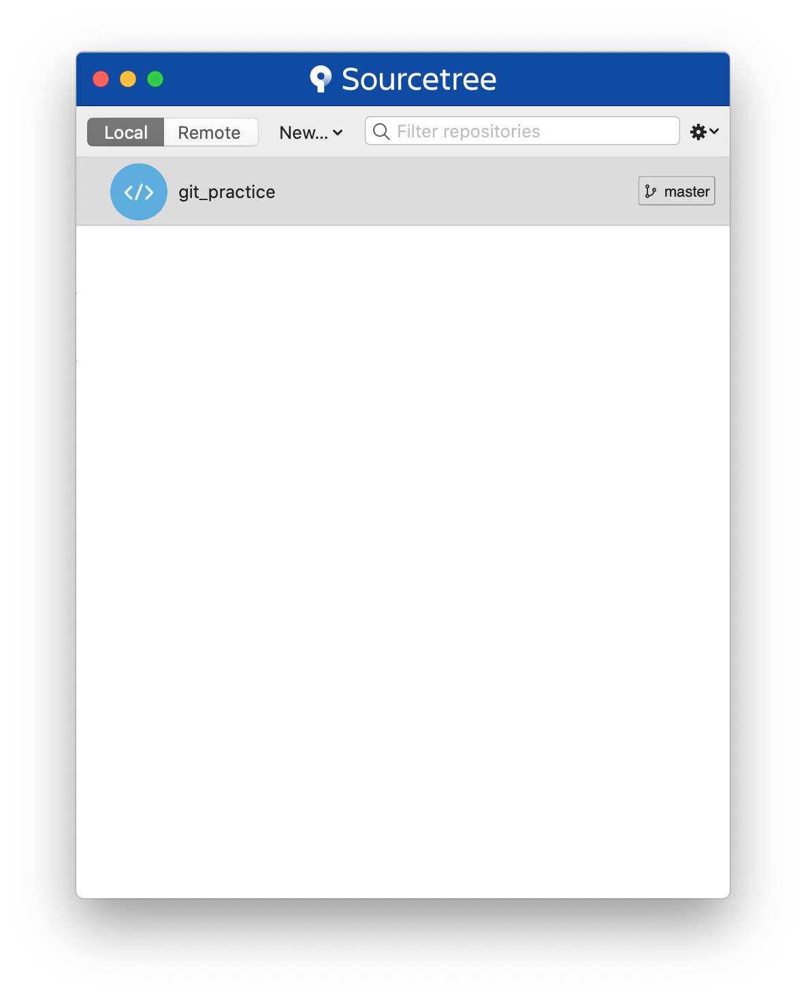
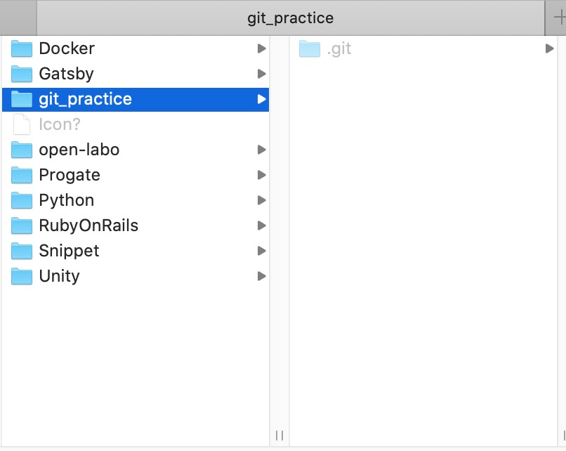

お仕事で資料やファイルを日々を作成／編集するとき、こんなことありませんか？

* 保存しちゃったけど、昨日の状態に戻したい…
* ファイルに手を入れたい。でも、元の状態も使うかもしれないから、ファイル複製しよう…
  ファイル名の後にverをつけたり、日付をつけたりして管理をしていらっしゃると思います。ただ、頻繁に手を入れて、バージョンを変えるのが煩雑になることもあるでしょう。

そんな時は**gitがおすすめ**です。
gitは、**ファイルの変更を記録してくれるバージョン管理システム**です。

システム開発では、毎日いろんな人がプログラムを編集しているので、プログラムの状態を変更履歴とセットで管理しています。

ちなみに、プログラムだけではなく、**Excel、PowerPointとか各種ファイルにも使えます。**

gitを導入すると
 企画書\_v1
 企画書\_v2
とかファイルを分けて管理しなくてよくなるのです♪

バージョン管理でできること

* ファイルの変更履歴を管理する
* 前のバージョンにファイルを戻す
* 変更履歴を分けて管理する

Git（バージョン管理）の詳しい概念を学ぶには[サルでも分かるバージョン管理入門](https://backlog.com/ja/git-tutorial/)をどうぞ。

普段は、誰かと協力してプログラムを書くために使われることが多いですが、
今回は**個人がPC上のファイルをバージョン管理する**ためのツールと使い方を紹介します。

## SourceTreeのインストール方法

今回はMacユーザー向けの解説になります。
Windowsで使いたい方は、[SourceTreeのダウンロードとインストール方法 | サービス | プロエンジニア](https://proengineer.internous.co.jp/content/columnfeature/6983)をご確認下さい。

### gitを入れる

Macの場合は、ターミナルから以下のように入力します

$ git --version

このように、バージョンの表記が出てきたら、OKです。

$ git --version git version 2.24.1 (Apple Git-126)

Xcodeをインストールして、ライセンスに同意していない場合は以下のように入力して、管理者パスワードを入れます。

$ sudo git --version Password: これで、gitを使う準備ができました。

### Sourcetreeをインストール

gitを使うだけならこれでOKなのですが。

コマンドでファイルを操作する必要があって、ややこしいです。

なので、Sourcetreeを使います。

アプリ上で、ファイルの変更をみれたり、直感的に操作できるソフトです。

[Sourcetree](https://www.sourcetreeapp.com/)のサイトから、アプリケーションをダウンロードして、インストールします。

## Sourcetreeでファイルをバージョン管理する

まずは、バージョン管理したいフォルダを設定します。

右クリック＞NEWを選びます。

「Create Local Repository(新規ローカルリポジトリを作成)」を選びます

 バージョン管理するフォルダの場所を選びます。

これで、追加されました！

画面上で新しく追加したフォルダ（ここでは70Manual）をダブルクリックすると、こんな画面が開きます。

ここに、変更履歴などが表示されます。

ファインダーから、フォルダを見ると図のように、「.git」というファイルが追加されています。

これで、準備完了です！

### これが基本！コミットで変更を記録する

ここから、具体的なバージョン管理するかをみていきます。

まずは、先ほど作ったディレクトリにファイルを置いてみましょう。
ここでは、Pagesで作った説明資料を置いてみました。

 そうすると、Sourcetree画面上にファイルがでてきます。

 そこで、メッセージ欄に「新規作成」とメッセージをいれて、コミットボタンを押します。

コミットボタンを押すと、
本当にバージョンコントロールに追加していいですか？
ファイルサイズ大きいですけどいいですか？
と、聞かれるかもしれませんが「OK」で進みます。

コミットとは **「コミット」とは変更履歴を記録することです。**

自分で作業が終わったときに、コミットボタンを押して、「何を変更したか」メッセージを残すことができます。

ファイルが保存されるごとに勝手に変更履歴が追加されるわけではありませんので注意くださいませ。

コミットが終わった後、Historyを選ぶと、ファイルの変更履歴が残ります。

続いて、ファイルを編集してみましょう。説明資料をPagesで編集→保存します。
すると、File Statusに変更があったファイルが表示されます。

ちなみに、今回はOffice系のソフトのファイルなので、変更内容を画面上では確認できません。
テキストファイルだと、変更の差分を確認したり、合体できるようになります。

 ファイルにチェックを入れて、メッセージを入れて、コミットします。

編集履歴が追記されています。

## まとめ

* git＝ファイルのバージョン管理ツール
* SourceTreeで視覚的に編集履歴が見える
* コミットすると、ファイルの変更を記録する
 いかがでしたか？
何度も更新が入るファイルはこれを機に、バージョン管理しちゃった方が作業が楽になるかもしれませんね。

 さらに、プログラマーさんはGitHubと連携することで、Web上でプログラムを公開したり、複数の開発者と協力してプロジェクトを進めることができます。

