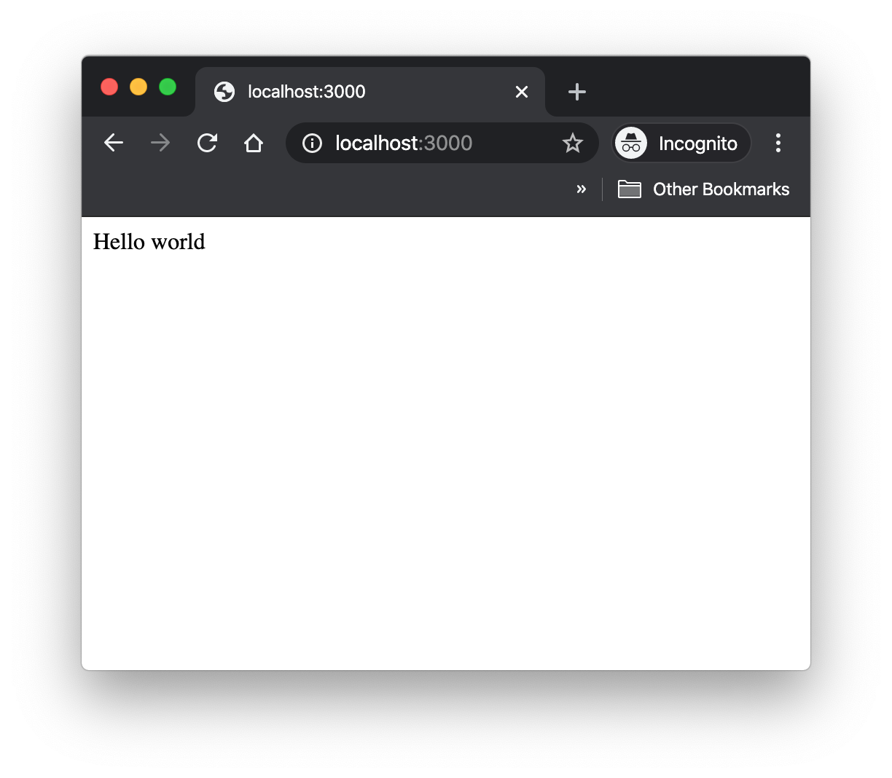

Node.jsをはじめてさわってみました。

動かすまでに色々疑問がでてきたので、Node.jsの基本と自分のPCでプログラムを書いて動かせるようになるまでに必要な知識をまとめました。

【この記事の内容】
* そもそもNode.jsとは？
* Node.jsを始める前の基礎知識
* これから学びたい人へはじめ方と環境構築

## Node.jsとは？

Node.jsとは「JavaScriptをサーバーサイドで動かすための仕組み」らしい。

んん…サーバーサイドとは？

【クライアント】
ブラウザ上で見える画面のデザインや、ユーザーがブラウザ上で行う操作を扱うためのプログラム。
使われるプログラミング言語：HTML/CSS、JavaScript(jQuery)

【サーバーサイド】
ブラウザから受け取った情報を、データベースと接続したり、処理するためのプログラム。
使われるプログラミング言語：Ruby, Java, PHP, Python

Node.jsでできること Web上で動くアプリケーション（Webアプリ）、ソーシャルゲームが作れる（らしい）

### Node.jsを使うのに必要な事前知識

【HTML/CSS】
文章や画像をレイアウトしてWebページに表示する。

【JavaScript】
ブラウザ上で動くプログラミング言語。
UI(ユーザーが操作する部分)を作るときに使われる。

JavaScriptを使うと、

* スライド、ポップアップやアコーディオンなどのアニメーション
* フォームの入力チェックをする
などの動きのあるWebページを作ることができる。

【UNIXコマンド】
環境を構築したり、プログラムを動かすときに、ターミナルからコマンドを打ち込むので、基本操作を知っていると進めやすい。

### Node.jsはどうやって学ぶの？

私はProgateのレッスンで学び始めました。

Progateでは、スライドでレクチャーを読む→実際プログラムを書きながらNode.js使い方を学べます。

【Progateのレッスン内容】
* Node.jsとExpress （node.jsを使いやすくするためのパッケージ）でページを表示する方法
* データベースの内容をページに表示する
* リストアプリを作りつつ、データベースを操作する

全部で3レッスンあるのですが、各レッスン2時間ずつ計６時間で学習できました。


## 5分でできるNode.jsのインストール

動作環境はMacで進めております。

[Node.js公式サイト](https://nodejs.org/en/)から、ダウンロードしてインストールすることで、導入できます。


ここからは、ターミナルを開いて、コマンドを入力していきます。

```
$node -v
```
バージョンが表示されればOK

あわせて、npm（Node Package Manager）も使えるようになっています。npmには、Nodeを効率的にプログラムを書くためのパッケージが入っています。

```
$npm -v
```

こちらもバージョンがでればOK。

【参考記事】
[MacにNode.jsとnpmをインストールする方法【初心者向け】 | Public Constructor](https://public-constructor.com/install-node-and-npm-on-mac/)

## はじめてのNode.jsプログラム〜Hello Worldを表示させる

環境構築がすんだら、次に知りたいのは、「実際にプログラムを作って動かすには、具体的には何をしたらいの？」ってことですよね。

### 1. Node.jsプロジェクトの新規作成

まずは、プロジェクト用のフォルダを作成します。（今回は名前をsample_appとしました）


プロジェクト用フォルダ(sample_app)に移動します。

```
$cd sample_app
```

プロジェクト用フォルダで以下のnpm int(初期化)を実行します。

```
$npm init
```

アプリケーションの名前やバージョン、説明などを、色々聞かれますが、基本的にはEnterだけを入力すればOK。

entry point : (index.js)のところは、「app.js」にしました。
初期ファイルがapp.jsになります。

このコマンドを実行すると、package.jsonができています。package.jsonは、プロジェクト構成を管理するためのファイルです。

### 2.Expressをインストールする

Expressは、Node.jsを効率的に使うためのコードが入ったライブラリ。

```
$npm install express --save
```

–saveとオプション記載することで、package.jsonにExpressインストールした旨を記載できます。

### 3. Hello Worldを表示させるプログラムを書く

新規ファイルを作成し、app.jsを作成します。
```js:title=app.js
// Expressの読み込み
const express = require('express')
// Expressアプリの作成
const app = express()

// アクセスされたらHello Worldを表示
app.get('/', (req, res) => {
res.send('Hello world')
});

// ポート番号3000でサーバーを起動
app.listen(3000, () => console.log('Example app listening on port 3000!'))
```

【参考記事】
[Express の「Hello World」の例](https://expressjs.com/ja/starter/hello-world.html)

### 4. nodeでプログラムを実行

ターミナルから以下コマンドを入力します。

```
$node app.js
```

これで、サーバーが開始されます。

### 5. ブラウザで Hello Worldの表示確認

http://localhost:3000/にアクセスします。
画面に「Hello World!」と表示されてればバッチリ☺️



サーバーを終了するときはターミナルで [control + C]で終了します。

## Node.jsの基本まとめ

はじめてだと、いろんな用語がでてくるなぁ〜〜。

* Node.jsはJavaScriptの進化系。ブラウザ上の操作だけでなく、アプリも作れたりする。
* npm(Node Package Manager)にはNode.jsを効率に使うための小道具が入っている。その一つがExpress。
* Node.jsは公式サイトからインストールできる

ひとまず、Hello Worldができたので、ここから好きにプログラムを改変していきましょう。

Progateで学んでいる方はフォルダに、レッスンで使ったコードを配置すると、ローカルでも動かせるようになります＾＾